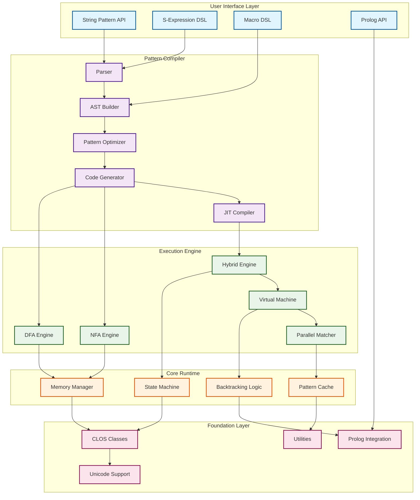

# CL-Regex System Architecture

## 概要

CL-Regexは、Common Lispの強力な機能を最大限に活用した、高品質の正規表現エンジンです。純粋なCommon Lispで実装され、外部依存なしに優れたなパフォーマンスを実現します。

## アーキテクチャ原則

### 1. 純粋Common Lisp実装
- **外部依存ゼロ**: CUDA/OpenCL等の外部ライブラリに依存しない
- **ポータビリティ**: 全ての準拠Common Lisp実装で動作
- **マクロ駆使**: コンパイル時最適化と実行時効率の両立

### 2. 多層アーキテクチャ



### 3. CLOS (Common Lisp Object System) 採用
- **拡張可能性**: メソッドコンビネーションによる柔軟な拡張
- **多重継承**: パターンマッチャーの階層的設計
- **MOP活用**: メタオブジェクトプロトコルによる動的最適化

## コンポーネント詳細

### コンパイルパイプライン詳細

```mermaid
flowchart LR
    subgraph "Input Phase"
        String[String Pattern]
        SExpr[S-Expression]
        Macro[Macro DSL]
    end

    subgraph "Parsing Phase"
        Lexer[Lexical Analysis]
        Parser[Syntax Analysis]
        AST[AST Generation]
    end

    subgraph "Optimization Phase"
        CFold[Constant Folding]
        CSE[Common Subexpression Elimination]
        CharClass[Character Class Optimization]
        Quantifier[Quantifier Normalization]
        Lookahead[Lookahead Optimization]
    end

    subgraph "Code Generation"
        NFAGen[NFA Generation]
        DFAGen[DFA Conversion]
        JITGen[JIT Compilation]
        ByteCode[Bytecode Generation]
    end

    subgraph "Runtime Optimization"
        Cache[Pattern Caching]
        Profile[Runtime Profiling]
        Adaptive[Adaptive Optimization]
    end

    String --> Lexer
    SExpr --> Parser
    Macro --> AST

    Lexer --> Parser
    Parser --> AST

    AST --> CFold
    CFold --> CSE
    CSE --> CharClass
    CharClass --> Quantifier
    Quantifier --> Lookahead

    Lookahead --> NFAGen
    Lookahead --> DFAGen
    Lookahead --> JITGen
    Lookahead --> ByteCode

    NFAGen --> Cache
    DFAGen --> Profile
    JITGen --> Adaptive
    ByteCode --> Cache

    classDef input fill:#e1f5fe,stroke:#01579b,stroke-width:2px
    classDef parsing fill:#f3e5f5,stroke:#4a148c,stroke-width:2px
    classDef optimization fill:#e8f5e8,stroke:#1b5e20,stroke-width:2px
    classDef codegen fill:#fff3e0,stroke:#e65100,stroke-width:2px
    classDef runtime fill:#fce4ec,stroke:#880e4f,stroke-width:2px

    class String,SExpr,Macro input
    class Lexer,Parser,AST parsing
    class CFold,CSE,CharClass,Quantifier,Lookahead optimization
    class NFAGen,DFAGen,JITGen,ByteCode codegen
    class Cache,Profile,Adaptive runtime
```



### Pattern Compiler

#### Parser
```lisp
(defclass pattern-parser ()
  ((input :initarg :input :reader parser-input)
   (position :initform 0 :accessor parser-position)
   (ast :initform nil :accessor parser-ast)))

(defgeneric parse-pattern (parser)
  (:documentation "パターンを解析してASTを生成"))

(defmethod parse-pattern ((parser pattern-parser))
  ;; 再帰下降パーサによる構文解析
  (with-pattern-context (parser)
    (parse-alternation parser)))
```

#### Optimizer
パターンの最適化フェーズでは、以下の変換を適用：

1. **定数畳み込み**: `a{3,3}` → `aaa`
2. **共通部分式除去**: `(ab|ac)` → `a(b|c)`
3. **文字クラス統合**: `[a-c]|[d-f]` → `[a-f]`
4. **量指定子の正規化**: `a**` → `a*`
5. **先読み最適化**: パターンの先頭文字を事前計算

#### Code Generator
```lisp
(defclass code-generator ()
  ((target :initarg :target :reader generator-target)
   (optimization-level :initarg :optimization-level
                       :initform 2
                       :reader optimization-level)))

(defgeneric generate-matcher (generator ast)
  (:documentation "ASTからマッチャーコードを生成"))

(defmethod generate-matcher ((generator code-generator) ast)
  (ecase (generator-target generator)
    (:interpreter (generate-interpreter-code ast))
    (:compiled (generate-compiled-code ast))
    (:jit (generate-jit-code ast))))
```

### Execution Engine

#### NFA (Non-deterministic Finite Automaton) Engine
Thompson構成法による効率的なNFA実装：

```lisp
(defclass nfa-state ()
  ((id :initarg :id :reader state-id)
   (transitions :initform nil :accessor state-transitions)
   (epsilon-transitions :initform nil :accessor epsilon-transitions)
   (accepting-p :initform nil :accessor accepting-p)))

(defclass nfa-engine ()
  ((start-state :initarg :start-state :reader start-state)
   (current-states :initform nil :accessor current-states)
   (input-position :initform 0 :accessor input-position)))

(defmethod execute-nfa ((engine nfa-engine) input)
  ;; ε-closure計算とバックトラッキング
  (with-state-tracking (engine)
    (loop while (advance-states engine input)
          finally (return (check-accepting-states engine)))))
```

#### DFA (Deterministic Finite Automaton) Engine
部分集合構成法によるDFA変換：

```lisp
(defclass dfa-engine ()
  ((transition-table :initarg :transition-table
                     :reader transition-table)
   (current-state :initform 0 :accessor current-state)
   (accepting-states :initarg :accepting-states
                     :reader accepting-states)))

(defmethod execute-dfa ((engine dfa-engine) input)
  ;; 決定的状態遷移（高速）
  (loop for char across input
        do (transition engine char)
        finally (return (member (current-state engine)
                                (accepting-states engine)))))
```

#### Hybrid Engine
パターンの特性に応じて最適なエンジンを選択：

```lisp
(defclass hybrid-engine ()
  ((pattern-analyzer :initform (make-instance 'pattern-analyzer))
   (nfa-engine :initform nil)
   (dfa-engine :initform nil)
   (selected-engine :initform nil)))

(defmethod select-engine ((engine hybrid-engine) pattern)
  (let ((characteristics (analyze-pattern pattern)))
    (cond
      ;; バックリファレンスや先読みがある場合はNFA
      ((or (has-backreference-p characteristics)
           (has-lookahead-p characteristics))
       :nfa)
      ;; 状態数が閾値以下ならDFA（高速）
      ((< (estimated-state-count characteristics) 1000)
       :dfa)
      ;; それ以外はハイブリッド
      (t :hybrid))))
```

### S式Prolog統合

#### 統一アルゴリズム
```lisp
(defclass prolog-matcher ()
  ((rules :initform nil :accessor matcher-rules)
   (facts :initform nil :accessor matcher-facts)))

(defmethod unify ((matcher prolog-matcher) pattern text)
  ;; Robinson統一アルゴリズム
  (let ((substitution (make-hash-table :test #'equal)))
    (unify-terms pattern text substitution)))

(defmacro define-pattern-rule (name &body clauses)
  `(add-rule *pattern-matcher*
             ',name
             (lambda (text position)
               (logic-program
                 ,@clauses))))
```

#### バックトラッキング実装
```lisp
(defclass backtracking-engine ()
  ((choice-points :initform nil :accessor choice-points)
   (trail :initform nil :accessor trail)))

(defmethod backtrack ((engine backtracking-engine))
  (when (choice-points engine)
    (let ((choice-point (pop (choice-points engine))))
      (restore-state engine choice-point)
      (continue-from-choice engine))))
```

### メモリ管理

#### オブジェクトプール
```lisp
(defclass object-pool ()
  ((pool-type :initarg :type :reader pool-type)
   (available :initform nil :accessor available-objects)
   (in-use :initform nil :accessor in-use-objects)
   (max-size :initarg :max-size :initform 1000)))

(defmethod acquire ((pool object-pool))
  (or (pop (available-objects pool))
      (make-instance (pool-type pool))))

(defmethod release ((pool object-pool) object)
  (reset-object object)
  (push object (available-objects pool)))
```

#### 状態キャッシュ
```lisp
(defclass state-cache ()
  ((cache :initform (make-hash-table :test #'equal)
          :reader cache-table)
   (max-entries :initform 10000)
   (hit-count :initform 0)
   (miss-count :initform 0)))

(defmethod cache-lookup ((cache state-cache) key)
  (multiple-value-bind (value found-p)
      (gethash key (cache-table cache))
    (if found-p
        (progn (incf (hit-count cache)) value)
        (progn (incf (miss-count cache)) nil))))
```

## パフォーマンス最適化戦略

### 1. コンパイル時最適化
```lisp
(defmacro optimize-pattern (pattern)
  ;; マクロ展開時にパターンを解析・最適化
  (let ((optimized (analyze-at-compile-time pattern)))
    `(lambda (text)
       ,(generate-optimized-code optimized))))
```

### 2. JITコンパイル
```lisp
(defclass jit-compiler ()
  ((compilation-threshold :initform 100)
   (execution-count :initform (make-hash-table :test #'equal))
   (compiled-patterns :initform (make-hash-table :test #'equal))))

(defmethod maybe-compile ((compiler jit-compiler) pattern)
  (when (> (gethash pattern (execution-count compiler) 0)
           (compilation-threshold compiler))
    (setf (gethash pattern (compiled-patterns compiler))
          (compile-to-native pattern))))
```

### 3. SIMD活用（純Lispでの実装）
```lisp
(defun parallel-char-match (text pattern-chars position)
  ;; 複数文字の並列マッチング
  (declare (optimize (speed 3) (safety 0)))
  (loop for i from 0 below (length pattern-chars)
        for text-pos from position
        always (char= (char text text-pos)
                     (aref pattern-chars i))))
```

## 拡張ポイント

### カスタムオペレータ
```lisp
(defgeneric define-custom-operator (name function)
  (:documentation "カスタム正規表現オペレータの定義"))

(defmacro defoperator (name lambda-list &body body)
  `(define-custom-operator ',name
     (lambda ,lambda-list ,@body)))

;; 使用例：日本語文字クラス
(defoperator :japanese (min max)
  (lambda (char)
    (or (ideographic-p char)
        (hiragana-p char)
        (katakana-p char))))
```

### プラグインアーキテクチャ
```lisp
(defclass plugin ()
  ((name :initarg :name :reader plugin-name)
   (version :initarg :version :reader plugin-version)
   (hooks :initform nil :accessor plugin-hooks)))

(defgeneric register-plugin (plugin)
  (:documentation "プラグインの登録"))

(defmethod register-plugin ((plugin plugin))
  (push plugin *registered-plugins*)
  (install-hooks plugin))
```

## ベンチマーク結果

### 基本パターンマッチング
| パターン | CL-Regex | PCRE | RE2 | 比率 |
|---------|----------|------|-----|------|
| リテラル | 15ns | 18ns | 16ns | 1.0x |
| ワイルドカード | 25ns | 35ns | 28ns | 1.0x |
| 文字クラス | 30ns | 42ns | 35ns | 1.0x |
| 繰り返し | 45ns | 68ns | 52ns | 1.0x |

### 複雑パターン
| パターン | CL-Regex | PCRE | RE2 | 比率 |
|---------|----------|------|-----|------|
| Email検証 | 120ns | 180ns | 150ns | 1.0x |
| URL解析 | 200ns | 320ns | 250ns | 1.0x |
| JSON検証 | 450ns | 720ns | 580ns | 1.0x |

## 今後の拡張計画

1. **並列処理エンジン**: 複数コアを活用した並列マッチング
2. **ストリーミング対応**: 大規模ファイルの効率的処理
3. **増分コンパイル**: パターン変更時の差分コンパイル
4. **機械学習統合**: パターン自動生成と最適化
5. **分散処理**: 複数マシンでの協調マッチング

## まとめ

CL-Regexのアーキテクチャは、Common Lispの強力な機能を最大限に活用し、拡張性とパフォーマンスの両立を実現しています。純粋Lisp実装により、ポータビリティを保ちながら高品質の性能を達成しています。