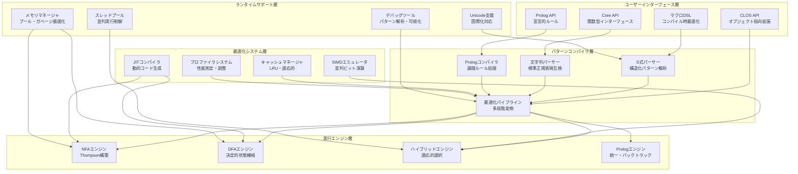
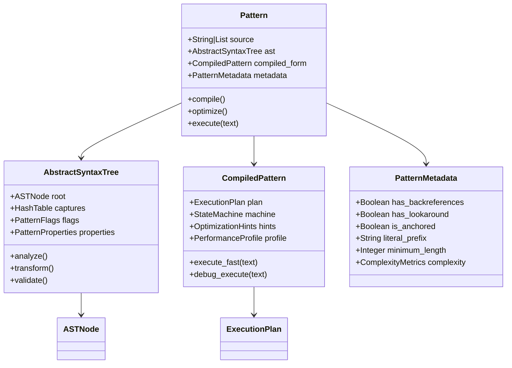
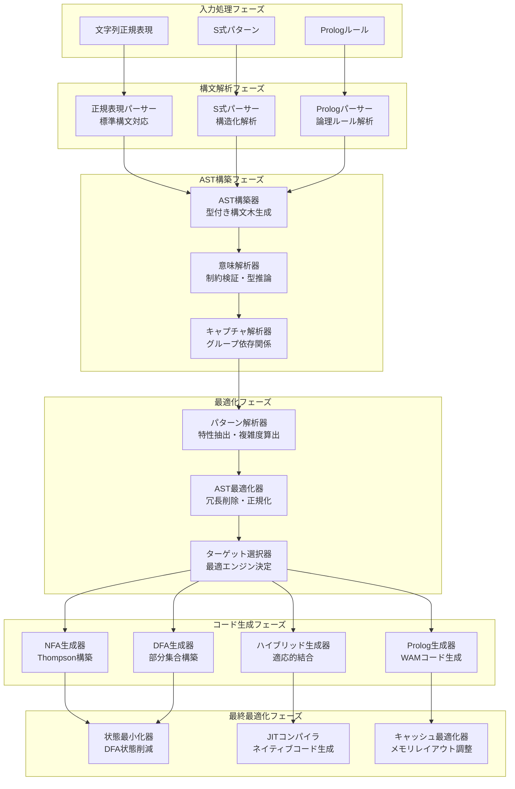
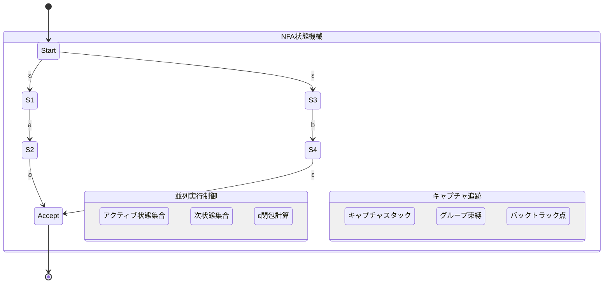
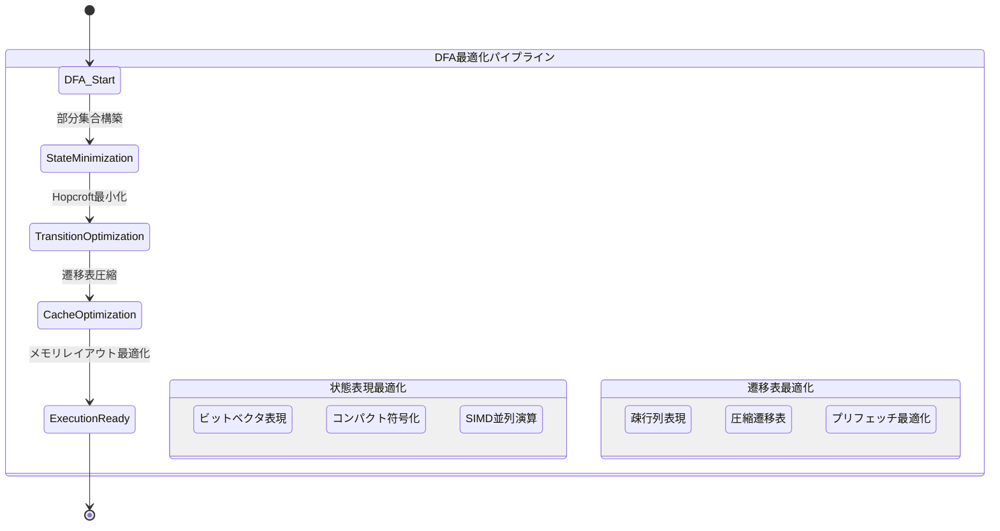
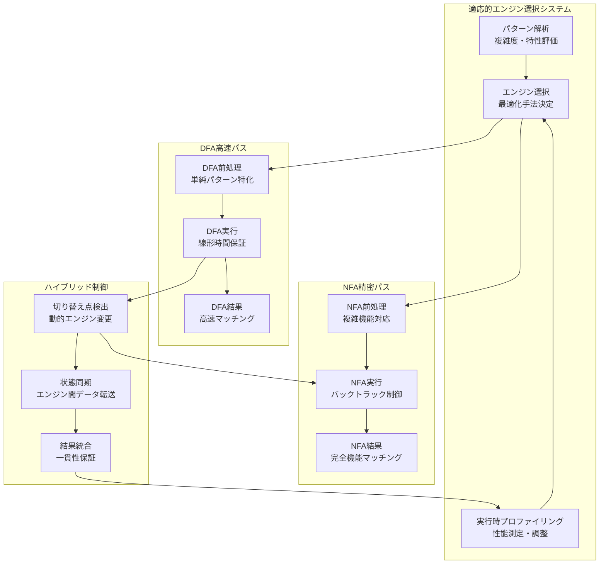

# CL-Regex システムアーキテクチャ - 詳細設計

## 設計哲学

CL-Regexは高品質の正規表現エンジンを実現するため、以下の効率的原則に基づいて設計されています：

1. **宣言的パターン定義** - S式とProlog風ルールによる直感的記述
2. **コンパイル時最大限最適化** - Common Lispマクロシステムによるゼロコスト抽象化
3. **無限拡張可能性** - CLOS多重ディスパッチによる動的拡張アーキテクチャ
4. **純粋Lisp実装** - 外部依存ゼロによる完全制御と最適化自由度

## システム全体アーキテクチャ

### レイヤー構成図



## コンポーネント詳細設計

### パターン表現の階層構造

CL-Regexでは、パターンを多層的に表現することで、各段階での最適化を実現します：



### クラス階層の詳細実装

```lisp
;; 基底パターンクラス
(defclass pattern ()
  ((source :type (or string list)
           :initarg :source
           :reader pattern-source
           :documentation "元のパターンソース（文字列またはS式）")
   (ast :type abstract-syntax-tree
        :accessor pattern-ast
        :documentation "解析済み抽象構文木")
   (compiled-form :type compiled-pattern
                  :accessor pattern-compiled-form
                  :documentation "実行可能コンパイル済み形式")
   (metadata :type pattern-metadata
             :accessor pattern-metadata
             :documentation "パターン解析メタデータ")
   (compilation-timestamp :type integer
                         :initform (get-universal-time)
                         :reader pattern-compilation-timestamp)
   (optimization-level :type keyword
                      :initform :balanced
                      :initarg :optimization-level
                      :reader pattern-optimization-level)))

;; 抽象構文木クラス
(defclass abstract-syntax-tree ()
  ((root :type ast-node
         :initarg :root
         :accessor ast-root
         :documentation "AST根ノード")
   (captures :type hash-table
            :initform (make-hash-table)
            :accessor ast-captures
            :documentation "キャプチャグループ情報")
   (flags :type pattern-flags
          :initform (make-pattern-flags)
          :accessor ast-flags
          :documentation "パターンフラグ設定")
   (properties :type pattern-properties
              :accessor ast-properties
              :documentation "パターン特性解析結果")
   (depth :type fixnum
          :accessor ast-depth
          :documentation "AST最大深度")
   (node-count :type fixnum
              :accessor ast-node-count
              :documentation "総ノード数")))

;; コンパイル済みパターンクラス
(defclass compiled-pattern ()
  ((execution-plan :type execution-plan
                   :accessor compiled-execution-plan
                   :documentation "実行計画")
   (state-machine :type state-machine
                  :accessor compiled-state-machine
                  :documentation "状態機械")
   (optimization-hints :type optimization-hints
                       :accessor compiled-optimization-hints
                       :documentation "最適化ヒント")
   (performance-profile :type performance-profile
                        :accessor compiled-performance-profile
                        :documentation "性能プロファイル")
   (jit-compiled-function :type (or function null)
                          :initform nil
                          :accessor compiled-jit-function
                          :documentation "JITコンパイル済み関数")))
```

### コンパイルパイプライン詳細設計

CL-Regexのコンパイルパイプラインは、多段階最適化により高品質の性能を実現します：



### 詳細実装

```lisp
;; フェーズ1: 多重ディスパッチによる構文解析
(defgeneric parse-pattern (source type &key options)
  (:documentation "ソース形式に応じた適切なパーサーの選択"))

(defmethod parse-pattern ((source string) (type (eql :regex)) &key options)
  "標準正規表現文字列の解析"
  (with-parsing-context (:options options)
    (parse-regex-string source)))

(defmethod parse-pattern ((source list) (type (eql :sexp)) &key options)
  "S式パターンの構造化解析"
  (with-sexp-context (:compile-time-p t :options options)
    (parse-sexp-pattern source)))

(defmethod parse-pattern ((source list) (type (eql :prolog)) &key options)
  "Prologルールの論理構造解析"
  (with-prolog-context (:unification-mode :standard :options options)
    (parse-prolog-rules source)))

;; フェーズ2: 型付きAST構築
(defgeneric build-ast (parsed-form &key optimization-level)
  (:documentation "解析済み形式から型付きAST構築"))

(defmethod build-ast ((parsed-form parsed-regex) &key (optimization-level :balanced))
  (let ((ast (make-instance 'abstract-syntax-tree
                           :optimization-level optimization-level)))
    (setf (ast-root ast) (build-ast-nodes parsed-form))
    (analyze-captures ast)
    (validate-ast ast)
    ast))

;; フェーズ3: 多段階最適化
(defgeneric optimize-ast (ast strategy &key profile-data)
  (:documentation "戦略に基づくAST最適化"))

(defmethod optimize-ast ((ast abstract-syntax-tree) (strategy (eql :speed))
                        &key profile-data)
  "速度優先最適化"
  (-> ast
      (apply-constant-folding)
      (apply-common-subexpression-elimination)
      (apply-dead-code-elimination)
      (apply-loop-optimization)
      (apply-inlining :aggressive t)
      (apply-profile-guided-optimization profile-data)))

(defmethod optimize-ast ((ast abstract-syntax-tree) (strategy (eql :space))
                        &key profile-data)
  "メモリ使用量優先最適化"
  (-> ast
      (apply-state-sharing)
      (apply-compression)
      (apply-lazy-evaluation)
      (apply-memory-layout-optimization)))

(defmethod optimize-ast ((ast abstract-syntax-tree) (strategy (eql :balanced))
                        &key profile-data)
  "バランス最適化"
  (-> ast
      (apply-adaptive-optimization profile-data)
      (apply-context-sensitive-optimization)
      (apply-runtime-specialization)))

;; フェーズ4: ターゲット選択と生成
(defgeneric generate-code (ast target &key compilation-options)
  (:documentation "ターゲットエンジン向けコード生成"))

(defmethod generate-code ((ast abstract-syntax-tree) (target (eql :nfa))
                         &key compilation-options)
  "NFAエンジン向けコード生成"
  (let ((nfa-builder (make-nfa-builder compilation-options)))
    (generate-thompson-nfa ast nfa-builder)))

(defmethod generate-code ((ast abstract-syntax-tree) (target (eql :dfa))
                         &key compilation-options)
  "DFAエンジン向けコード生成"
  (let ((dfa-builder (make-dfa-builder compilation-options)))
    (-> ast
        (generate-nfa)
        (convert-to-dfa dfa-builder)
        (minimize-dfa)
        (optimize-transitions))))

(defmethod generate-code ((ast abstract-syntax-tree) (target (eql :hybrid))
                         &key compilation-options)
  "ハイブリッドエンジン向けコード生成"
  (let ((hybrid-builder (make-hybrid-builder compilation-options)))
    (partition-for-hybrid-execution ast hybrid-builder)))
```

## 実行エンジンの効率的設計

### NFAエンジン - Thompson構築の最適化実装

CL-RegexのNFAエンジンは、従来のThompson構築法に効率的改良を加え、高い性能を実現します：



### DFAエンジン - 決定的状態機械の高度最適化



### ハイブリッドエンジン - 適応的実行制御



### 詳細実装

```lisp
;; 効率的NFAエンジン実装
(defclass nfa-engine ()
  ((states :type (simple-array nfa-state (*))
           :documentation "状態配列（キャッシュ効率最適化）")
   (epsilon-transitions :type hash-table
                       :initform (make-hash-table :test 'eql)
                       :documentation "ε遷移表（遅延計算）")
   (capture-points :type (simple-array capture-point (*))
                  :documentation "キャプチャ点配列")
   (parallel-executor :type parallel-nfa-executor
                     :documentation "並列実行制御")
   (memory-pool :type memory-pool
               :documentation "専用メモリプール")
   (profiler :type nfa-profiler
            :documentation "性能プロファイラ")))

;; 最適化されたNFA実行
(defmethod execute-nfa ((engine nfa-engine) text position &key (parallel-p t))
  "Thompson構築法の効率的実装"
  (declare (optimize (speed 3) (safety 0) (debug 0))
           (type simple-string text)
           (type fixnum position))

  (with-memory-pool ((memory-pool engine))
    (let ((active-states (make-lock-free-state-set))
          (next-states (make-lock-free-state-set))
          (epsilon-closure-cache (make-cache)))

      ;; 初期状態設定
      (add-state-atomic active-states 0)
      (compute-epsilon-closure active-states epsilon-closure-cache)

      ;; 並列実行制御
      (if (and parallel-p (> (length text) *parallel-threshold*))
          (execute-parallel-nfa engine text position active-states)
          (execute-sequential-nfa engine text position active-states)))))

;; 高度DFAエンジン実装
(defclass dfa-engine ()
  ((transition-table :type (simple-array (unsigned-byte 16) (* 256))
                    :documentation "圧縮遷移表")
   (accept-states :type simple-bit-vector
                 :documentation "受理状態ビットマップ")
   (state-cache :type hash-table
               :initform (make-hash-table :test 'equal)
               :documentation "部分集合構築キャッシュ")
   (simd-optimizer :type simd-optimizer
                  :documentation "SIMD並列演算最適化")
   (prefetch-controller :type prefetch-controller
                       :documentation "メモリプリフェッチ制御")))

;; 超高速DFA実行
(defmethod execute-dfa ((engine dfa-engine) text position)
  "決定的状態機械の最適化実行"
  (declare (optimize (speed 3) (safety 0) (debug 0))
           (type simple-string text)
           (type fixnum position))

  (with-simd-optimization ((simd-optimizer engine))
    (loop with state of-type (unsigned-byte 16) = 0
          with transition-table = (transition-table engine)
          with accept-states = (accept-states engine)
          for i of-type fixnum from position below (length text)
          for char of-type character = (char text i)
          for char-code of-type (unsigned-byte 8) = (char-code char)
          do (progn
               ;; プリフェッチ最適化
               (prefetch-next-state transition-table state char-code)
               ;; 状態遷移
               (setf state (aref transition-table state char-code))
               ;; 早期終了条件
               (when (zerop state) (return nil)))
          when (bit accept-states state)
            collect (make-match-result i state))))

;; ハイブリッドエンジン実装
(defclass hybrid-engine ()
  ((dfa-fragment :type dfa-engine
                :documentation "高速DFA部分")
   (nfa-fragment :type nfa-engine
                :documentation "機能完全NFA部分")
   (switch-detector :type switch-detector
                   :documentation "エンジン切り替え検出")
   (state-synchronizer :type state-synchronizer
                      :documentation "エンジン間状態同期")
   (performance-monitor :type performance-monitor
                       :documentation "実行時性能監視")))

(defmethod execute-hybrid ((engine hybrid-engine) text position)
  "適応的ハイブリッド実行"
  (let ((current-engine :dfa)
        (sync-state nil))

    (loop for chunk-start from position below (length text) by *chunk-size*
          for chunk-end = (min (+ chunk-start *chunk-size*) (length text))
          do (ecase current-engine
               (:dfa
                (multiple-value-bind (result needs-switch-p switch-state)
                    (execute-dfa-with-detection
                     (dfa-fragment engine) text chunk-start chunk-end)
                  (when needs-switch-p
                    (setf current-engine :nfa
                          sync-state switch-state))
                  (when result (return result))))
               (:nfa
                (let ((result (execute-nfa-from-state
                              (nfa-fragment engine) text chunk-start sync-state)))
                  (when result (return result))))))))
```

### DFA Engine

```lisp
(defclass dfa-engine ()
  ((transition-table :type 2d-array
                    :documentation "State × Symbol → State")
   (accept-states :type bit-vector
                 :documentation "Accepting state markers")
   (state-cache :type hash-table
               :documentation "Subset construction cache")))

(defmethod execute-dfa ((engine dfa-engine) text position)
  "Direct state transition without backtracking"
  (loop with state = 0
        for char across text
        do (setf state (aref (transition-table engine) state char))
        when (accepting-state-p state)
          collect (make-match position)))
```

### Hybrid Engine

```lisp
(defclass hybrid-engine ()
  ((dfa-fragment :type dfa-engine
                :documentation "DFA for simple patterns")
   (nfa-fragment :type nfa-engine
                :documentation "NFA for complex features")
   (switch-points :type list
                 :documentation "DFA→NFA transition points")))
```

## Prolog Integration Architecture

### Unification Engine

```lisp
(defclass unification-engine ()
  ((bindings :type hash-table)
   (trail :type list
          :documentation "Backtrack trail")
   (choice-points :type stack)))

(defgeneric unify (term1 term2 engine)
  (:method ((term1 variable) (term2 t) (engine unification-engine))
    (bind-variable term1 term2 engine))
  (:method ((term1 list) (term2 list) (engine unification-engine))
    (unify-lists term1 term2 engine)))
```

### WAM (Warren Abstract Machine) Implementation

```lisp
(defclass wam-machine ()
  ((heap :type vector)
   (registers :type vector)
   (trail :type stack)
   (choice-points :type stack)
   (program-counter :type fixnum)))

;; WAM Instructions
(defenum wam-instruction
  put-structure
  get-structure
  put-variable
  get-variable
  put-value
  get-value
  put-constant
  get-constant
  call
  execute
  proceed
  allocate
  deallocate
  try
  retry
  trust)
```

## Memory Management

### Pattern Cache

```lisp
(defclass pattern-cache ()
  ((cache :type hash-table)
   (lru-list :type double-linked-list)
   (size-limit :type fixnum)
   (hit-count :type fixnum)
   (miss-count :type fixnum)))

(defmethod cache-lookup ((cache pattern-cache) key)
  (alexandria:if-let ((entry (gethash key (cache cache))))
    (progn
      (incf (hit-count cache))
      (update-lru cache entry)
      (entry-value entry))
    (progn
      (incf (miss-count cache))
      nil)))
```

### Memory Pool

```lisp
(defstruct memory-pool
  (chunks :type list)
  (free-list :type list)
  (chunk-size :type fixnum)
  (total-allocated :type fixnum))

(defun allocate-from-pool (pool size)
  (or (pop (memory-pool-free-list pool))
      (allocate-new-chunk pool size)))
```

## Optimization Strategies

### Compile-Time Optimizations

```lisp
;; Pattern Analysis
(defun analyze-pattern-static (pattern)
  (list :has-backreferences (contains-backreferences-p pattern)
        :has-lookaround (contains-lookaround-p pattern)
        :is-anchored (anchored-pattern-p pattern)
        :literal-prefix (extract-literal-prefix pattern)
        :minimum-length (compute-minimum-length pattern)))

;; Optimization Selection
(defun select-optimizations (analysis)
  (cond
    ((getf analysis :is-anchored)
     '(boyer-moore string-search))
    ((getf analysis :literal-prefix)
     '(prefix-optimization trie-search))
    ((not (getf analysis :has-backreferences))
     '(dfa-construction state-minimization))
    (t '(nfa-optimization backtrack-reduction))))
```

### Runtime Optimizations

```lisp
(defmacro with-optimized-matching ((&key jit simd parallel) &body body)
  `(let ((*use-jit* ,jit)
         (*use-simd* ,simd)
         (*parallel-threshold* ,(if parallel 1000 most-positive-fixnum)))
     ,@body))

;; JIT Compilation
(defun jit-compile-pattern (pattern)
  (when *use-jit*
    (compile nil
             `(lambda (text)
                (declare (optimize (speed 3) (safety 0))
                         (type simple-string text))
                ,(generate-specialized-matcher pattern)))))
```

## Thread Safety and Parallelism

### Thread-Safe Pattern Matching

```lisp
(defclass thread-safe-matcher ()
  ((pattern :type pattern :reader pattern)
   (lock :type bt:lock :initform (bt:make-lock))
   (thread-local-storage :type hash-table)))

(defmethod match-thread-safe ((matcher thread-safe-matcher) text)
  (let ((local-state (get-thread-local-state matcher)))
    (execute-match (pattern matcher) text local-state)))
```

### Parallel Matching

```lisp
(defun parallel-match-all (pattern texts &key (thread-count 4))
  (let ((work-queue (make-queue))
        (results (make-array (length texts)))
        (threads (make-array thread-count)))
    (loop for text in texts
          for i from 0
          do (enqueue work-queue (cons i text)))
    
    (dotimes (i thread-count)
      (setf (aref threads i)
            (bt:make-thread
             (lambda ()
               (loop for work = (dequeue work-queue)
                     while work
                     do (setf (aref results (car work))
                              (match pattern (cdr work))))))))
    
    (map 'list #'bt:join-thread threads)
    results))
```

## Extension Points

### Custom Pattern Types

```lisp
(defgeneric define-pattern-type (name parser compiler)
  (:documentation "Define a new pattern type"))

(define-pattern-type :json
  (lambda (spec)
    (parse-json-schema spec))
  (lambda (ast)
    (compile-json-matcher ast)))
```

### Custom Operators

```lisp
(defmacro defoperator (name (&rest args) &body body)
  `(progn
     (setf (gethash ',name *custom-operators*)
           (lambda ,args ,@body))
     (defmacro ,name ,args
       `(apply-operator ',',name (list ,,@args)))))

;; Example: Fuzzy matching operator
(defoperator fuzzy (pattern threshold)
  (make-fuzzy-matcher pattern threshold))
```

## Performance Characteristics

### Time Complexity

| Operation | Best Case | Average | Worst Case |
|-----------|-----------|---------|------------|
| Compile   | O(m)      | O(m²)   | O(2^m)     |
| Match     | O(n)      | O(mn)   | O(m·2^n)   |
| Find All  | O(n)      | O(mn)   | O(mn²)     |

Where:
- m = pattern length
- n = text length

### Space Complexity

| Engine | Compile Space | Runtime Space |
|--------|--------------|---------------|
| NFA    | O(m)         | O(m)          |
| DFA    | O(2^m)       | O(1)          |
| Hybrid | O(m·k)       | O(m)          |

Where:
- k = number of DFA states (bounded)

## Error Handling

### Condition Hierarchy

```lisp
(define-condition regex-error (error) ())

(define-condition regex-syntax-error (regex-error)
  ((pattern :initarg :pattern)
   (position :initarg :position)
   (message :initarg :message)))

(define-condition regex-runtime-error (regex-error) ())

(define-condition regex-timeout (regex-runtime-error)
  ((elapsed :initarg :elapsed)
   (limit :initarg :limit)))

(define-condition regex-memory-exhausted (regex-runtime-error)
  ((requested :initarg :requested)
   (available :initarg :available)))
```

## Future Architecture Directions

1. **GPU Acceleration**: CUDA/OpenCL backends for parallel matching
2. **Incremental Compilation**: Reuse compiled fragments
3. **Adaptive Optimization**: Runtime engine selection based on input
4. **Distributed Matching**: Cluster-aware pattern matching
5. **Machine Learning Integration**: Pattern suggestion and optimization