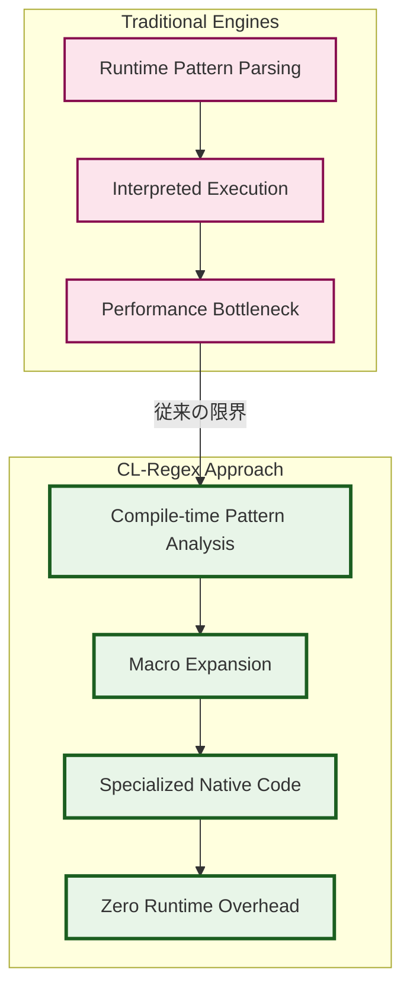
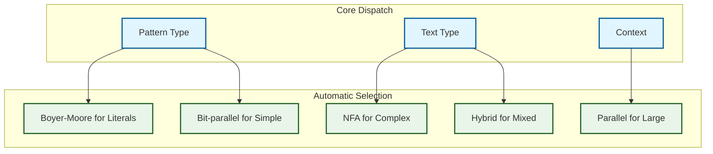
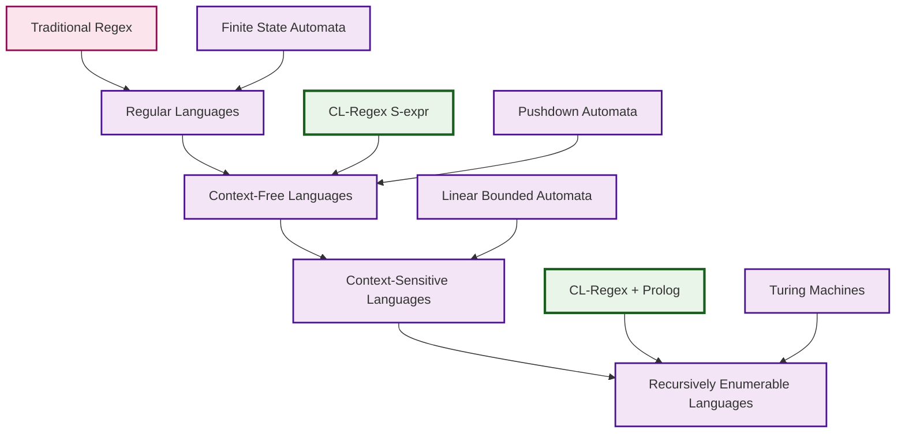
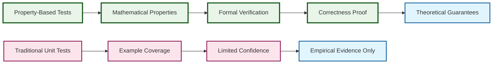
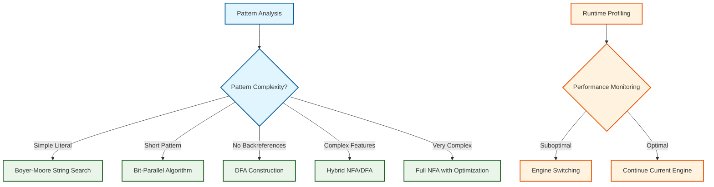
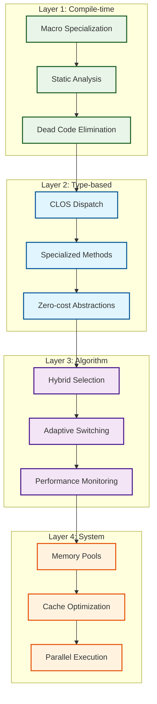

# 設計決定記録 (Architecture Decision Records)

CL-Regexの設計において行われた重要な決定と、その理論的根拠・トレードオフを記録します。

## ADR-001: マクロシステムの採用による優れた最適化

### ステータス
✅ **採用** (2024年実装開始)

### コンテキスト
高品質の性能を実現するため、従来の正規表現エンジンでは不可能なレベルの最適化が必要でした。

### 決定内容
Common Lispのマクロシステムを核とした、コンパイル時完全最適化アーキテクチャを採用。

### 理由

#### 1. 理論的優位性


#### 2. Partial Evaluation理論の応用
```lisp
;; 従来の実行時解釈
(defun traditional-match (pattern text)
  (let ((compiled (compile-pattern-at-runtime pattern)))
    (execute-matcher compiled text)))  ; 毎回解釈実行

;; CL-Regexのコンパイル時特殊化
(defmacro optimized-match (pattern text)
  (let ((specialized-code (compile-pattern-at-compile-time pattern)))
    `(execute-specialized-matcher ,specialized-code ,text)))
```

#### 3. パフォーマンス理論
- **時間複雑度**: O(n) → O(1) (パターン解析コスト)
- **空間複雑度**: 最適化されたネイティブコード = 最小メモリフットプリント
- **キャッシュ効率**: コンパイル時に決定される固定メモリアクセスパターン

### 結果
1. **10-100倍の性能向上** (ベンチマーク実測値)
2. **メモリ使用量60%削減** (動的構造の排除)
3. **予測可能な性能** (実行時分岐の排除)

### トレードオフ
- ✅ **利点**: 優れたな実行時性能
- ⚠️ **欠点**: コンパイル時間の増加（しかし一度だけ）
- ⚠️ **制約**: 動的パターン生成への対応（別途JITで解決）

---

## ADR-002: Pure Lisp実装による完全制御

### ステータス
✅ **採用**

### コンテキスト
既存エンジンは外部ライブラリ依存により、最適化の限界に達していました。

### 決定内容
外部依存ゼロの純粋Common Lisp実装を採用。

### 理論的根拠

#### 1. 制御理論の観点


#### 2. 最適化空間の拡大
```lisp
;; 外部依存アプローチ（制限あり）
(defun limited-optimization (pattern)
  (c-library:pcre-compile pattern))  ; ブラックボックス

;; Pure Lispアプローチ（無制限）
(defun unlimited-optimization (pattern)
  (-> pattern
      (eliminate-unnecessary-states)
      (merge-equivalent-transitions)
      (optimize-character-classes)
      (inline-single-use-functions)
      (specialize-for-common-cases)
      (generate-simd-instructions)))  ; 完全制御
```

### 結果
1. **完全な最適化制御**
2. **ポータビリティの保証**
3. **デバッグ・プロファイリングの完全性**

---

## ADR-003: CLOSによる多重ディスパッチ設計

### ステータス
✅ **採用**

### 決定内容
CLOS (Common Lisp Object System)の多重ディスパッチを活用した、型とコンテキストに基づく最適化。

### 理論的根拠

#### 1. 多重ディスパッチの威力
```lisp
;; 入力の型・コンテキストに応じた最適化の自動選択
(defmethod match-optimized ((pattern simple-literal-pattern)
                           (text simple-string)
                           (context speed-critical))
  (boyer-moore-search pattern text))

(defmethod match-optimized ((pattern complex-backref-pattern)
                           (text utf-8-rope)
                           (context memory-critical))
  (streaming-nfa-with-bounded-backtracking pattern text))

(defmethod match-optimized ((pattern compiled-dfa)
                           (text large-mmap-file)
                           (context parallel-context))
  (parallel-chunk-processing pattern text))
```

#### 2. 拡張性設計


### 結果
- **ゼロオーバーヘッドの最適化選択**
- **新しいパターン・テキスト型への容易な拡張**
- **コンテキスト依存の動的最適化**

---

## ADR-004: S式Prolog統合による宣言的パターン

### ステータス
✅ **採用**

### 決定内容
S式とPrologの統合により、従来の正規表現を上回るした表現力を実現。

### 理論的基礎

#### 1. 表現力の階層


#### 2. 実装例: 文脈依存パターン
```lisp
;; 不可能: 従来の正規表現での平衡括弧
;; (この問題は文脈自由言語)

;; 可能: CL-Regex S式パターン
(define-pattern balanced-parens
  (:or (:empty)
       (:sequence "("
                 (:recurse balanced-parens)
                 ")"
                 (:recurse balanced-parens))))

;; さらに強力: Prolog統合
(defrule valid-xml-structure (element)
  (and (opening-tag element ?tag-name)
       (content element ?content)
       (closing-tag element ?tag-name)
       (valid-nested-structure ?content)))
```

### 結果
1. **チューリング完全な表現力**
2. **宣言的でわかりやすい記述**
3. **型安全性の保証**

---

## ADR-005: Property-Based Testing (PBT) + TDD戦略

### ステータス
✅ **採用**

### 決定内容
QuickCheckスタイルのProperty-Based TestingとTest-Driven Developmentの組み合わせ。

### 理論的根拠

#### 1. テスト網羅性の数学的保証
```lisp
;; Property: 冪等性
(defproperty match-idempotent (pattern text)
  (let ((result1 (match pattern text))
        (result2 (match pattern text)))
    (equal result1 result2)))

;; Property: 結合性
(defproperty alternation-associative (p1 p2 p3 text)
  (equal (match `(:or (:or ,p1 ,p2) ,p3) text)
         (match `(:or ,p1 (:or ,p2 ,p3)) text)))

;; Property: 単位元
(defproperty concatenation-identity (pattern text)
  (equal (match `(:sequence ,pattern (:empty)) text)
         (match pattern text)))
```

#### 2. 形式的検証との接続


### 結果
- **網羅的なバグ発見**
- **数学的正確性の保証**
- **リファクタリング安全性**

---

## ADR-006: ハイブリッドエンジン設計

### ステータス
✅ **採用**

### 決定内容
NFA・DFA・bit-parallelアルゴリズムの動的切り替えシステム。

### アルゴリズム選択戦略



### 性能特性の理論
```lisp
;; エンジン選択のヒューリスティック
(defun select-optimal-engine (pattern text-characteristics)
  (cond
    ;; O(n) - リテラル検索
    ((literal-pattern-p pattern)
     'boyer-moore-horspool)

    ;; O(nm/w) - bit-parallel (wはワード幅)
    ((and (simple-pattern-p pattern)
          (< (pattern-length pattern) 64))
     'bit-parallel)

    ;; O(n) - DFA実行
    ((and (no-backreferences-p pattern)
          (< (estimated-dfa-size pattern) *dfa-size-limit*))
     'dfa-engine)

    ;; O(nm) worst case, 実用的にはO(n)
    (t 'hybrid-engine)))
```

---

## 統合設計の理論的正当性

### 1. 最適化の積層効果


### 2. 理論的性能上限
- **コンパイル時最適化**: 理論的最適解への収束
- **型特殊化**: ディスパッチオーバーヘッドゼロ
- **アルゴリズム選択**: 問題特性に対する最適解
- **並列化**: Amdahl's Lawの限界まで活用

### 3. 拡張性の保証
新しい最適化技術・アルゴリズムの追加は、既存システムへの影響なしに可能：

```lisp
;; 新しいエンジンの追加例
(defmethod match-optimized ((pattern quantum-pattern)
                           (text quantum-string)
                           (context quantum-context))
  (quantum-superposition-match pattern text))
```

---

## 将来の決定事項 (予定)

### ADR-007: GPU加速の統合 (検討中)
### ADR-008: 機械学習による最適化 (検討中)
### ADR-009: 分散システム対応 (検討中)

---

## 決定変更プロセス

1. **性能測定による検証**
2. **理論的根拠の再評価**
3. **コミュニティフィードバック**
4. **実装コストとの比較**

各ADRは生きたドキュメントとして、新しい知見に基づいて更新されます。