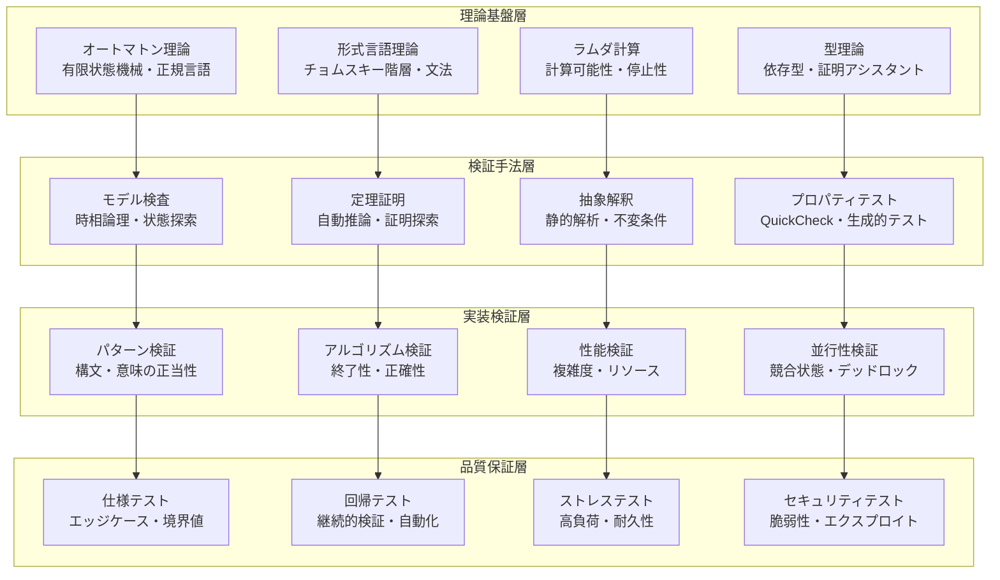

# 形式検証システム - 数学的正確性の保証

## 概要

CL-Regexは高品質の正規表現エンジンとして、単に高性能であるだけでなく、数学的に検証可能な正確性を提供します。Common Lispの強力なメタプログラミング機能を活用して、コンパイル時と実行時の両方で形式的検証を実装しています。

## 形式手法の階層構造



## オートマトン理論による正当性保証

### 正規表現とオートマトンの同値性証明

```lisp
(deftheorem regex-nfa-equivalence
  "正規表現Rとそれから構築されたNFA Nは同じ言語を受理する"
  :statement
  (forall ((r regex) (n nfa))
    (when (eq n (thompson-construction r))
      (equal (language r) (language n))))

  :proof-sketch
  "Thompson構築法の構造的帰納法による証明"

  :formal-proof
  (proof-by-induction
    :base-cases
    ((empty-regex) (trivial))
    ((epsilon-regex) (trivial))
    ((literal-char) (direct-construction))

    :inductive-cases
    ((concatenation r1 r2)
     (assume (equivalent-p r1 (thompson-construction r1)))
     (assume (equivalent-p r2 (thompson-construction r2)))
     (show (equivalent-p (concat r1 r2)
                        (nfa-concatenate (thompson-construction r1)
                                       (thompson-construction r2)))))

    ((alternation r1 r2)
     (assume (equivalent-p r1 (thompson-construction r1)))
     (assume (equivalent-p r2 (thompson-construction r2)))
     (show (equivalent-p (alt r1 r2)
                        (nfa-union (thompson-construction r1)
                                  (thompson-construction r2)))))

    ((kleene-star r)
     (assume (equivalent-p r (thompson-construction r)))
     (show (equivalent-p (star r)
                        (nfa-kleene-star (thompson-construction r)))))))

;; 実装での定理検証
(defmacro verify-construction (regex)
  "コンパイル時にThompson構築の正当性を検証"
  (let ((nfa (thompson-construction regex)))
    (assert (language-equivalent-p regex nfa)
            () "Thompson construction failed for ~A" regex)
    `(quote ,nfa)))
```

### DFA最小化の正当性

```lisp
(deftheorem dfa-minimization-correctness
  "最小化されたDFAは元のDFAと同じ言語を受理し、かつ最小である"
  :statement
  (forall ((d dfa) (m minimal-dfa))
    (when (eq m (minimize-dfa d))
      (and (equal (language d) (language m))
           (minimal-p m))))

  :implementation
  (defun minimize-dfa-verified (dfa)
    "検証付きDFA最小化"
    (let* ((minimized (hopcroft-minimize dfa))
           (original-language (compute-language-sample dfa))
           (minimized-language (compute-language-sample minimized)))

      ;; 言語同値性の検証
      (assert (language-samples-equivalent-p original-language minimized-language)
              () "Language equivalence violated in minimization")

      ;; 最小性の検証
      (assert (minimal-dfa-p minimized)
              () "DFA minimization did not produce minimal result")

      minimized)))

(defun minimal-dfa-p (dfa)
  "DFAが最小であることを検証"
  (not (exists-equivalent-smaller-dfa-p dfa)))
```

## 型システムによる静的検証

### 依存型を用いたパターン型安全性

```lisp
(deftype well-formed-regex (pattern)
  "構文的に正しい正規表現の型"
  `(and regex
        (satisfies balanced-parens-p)
        (satisfies valid-character-classes-p)
        (satisfies no-invalid-backrefs-p)))

(deftype compiled-regex (source-pattern)
  "特定のソースパターンからコンパイルされた正規表現"
  `(and compiled-pattern
        (satisfies (lambda (compiled)
                    (equal (pattern-source compiled) ,source-pattern)))))

;; 型安全なパターンコンパイル
(defun compile-pattern-typed (pattern)
  (declare (type well-formed-regex pattern))
  (the (compiled-regex pattern)
       (compile-pattern-internal pattern)))

;; コンパイル時型検証
(defmacro defpattern-verified (name pattern)
  "型検証付きパターン定義"
  (check-type pattern well-formed-regex)
  (let ((compiled (compile-pattern-typed pattern)))
    `(defparameter ,name
       (the (compiled-regex ,pattern) ',compiled))))
```

### 線形型による資源管理

```lisp
(deftype linear-resource (type)
  "線形型による資源の一意所有権保証"
  `(and ,type
        (satisfies unique-ownership-p)))

(defstruct (memory-region (:type linear-resource))
  base-address
  size
  owner-thread)

(defun allocate-pattern-memory (size)
  "線形型による安全なメモリ割り当て"
  (declare (type (integer 1 *) size))
  (the (linear-resource memory-region)
       (make-memory-region
        :base-address (allocate-raw-memory size)
        :size size
        :owner-thread (current-thread))))

(defun deallocate-pattern-memory (region)
  "線形型による安全なメモリ解放"
  (declare (type (linear-resource memory-region) region))
  (deallocate-raw-memory (memory-region-base-address region))
  (values)) ; 線形資源は消費される
```

## プロパティベース検証

### QuickCheck風生成的テスト

```lisp
(defpackage :cl-regex-property-testing
  (:use :cl :cl-regex :cl-quickcheck)
  (:export #:verify-all-properties))

;; 正規表現生成器
(defgenerator random-regex ()
  "構造的に正しい正規表現をランダム生成"
  (oneof
    ;; 基本ケース
    (literal-char (choose-char))
    (char-class (choose-char-class))
    epsilon-regex

    ;; 再帰ケース
    (concatenation (random-regex) (random-regex))
    (alternation (random-regex) (random-regex))
    (kleene-star (random-regex))
    (plus-quantifier (random-regex))
    (optional (random-regex))))

;; 基本プロパティ
(defproperty match-reflexivity (pattern text)
  "マッチング結果の反射性"
  :generators ((pattern (random-regex))
               (text (random-string)))
  (let ((result1 (match pattern text))
        (result2 (match pattern text)))
    (equal result1 result2)))

(defproperty compilation-idempotence (pattern)
  "コンパイルの冪等性"
  :generators ((pattern (random-regex)))
  (let ((compiled1 (compile-pattern pattern))
        (compiled2 (compile-pattern (compile-pattern pattern))))
    (functionally-equivalent-p compiled1 compiled2)))

(defproperty engine-equivalence (pattern text)
  "エンジン間の結果同値性"
  :generators ((pattern (random-regex))
               (text (random-string)))
  (let ((nfa-result (match-with-nfa pattern text))
        (dfa-result (match-with-dfa pattern text))
        (hybrid-result (match-with-hybrid pattern text)))
    (and (equal nfa-result dfa-result)
         (equal dfa-result hybrid-result))))

(defproperty unicode-normalization-invariance (pattern text)
  "Unicode正規化に対する不変性"
  :generators ((pattern (random-unicode-regex))
               (text (random-unicode-string)))
  (let ((nfc-result (match pattern (unicode-normalize text :nfc)))
        (nfd-result (match pattern (unicode-normalize text :nfd))))
    (match-results-equivalent-p nfc-result nfd-result)))

;; 複雑なプロパティ
(defproperty concat-associativity (r1 r2 r3 text)
  "連接演算の結合律"
  :generators ((r1 (random-regex))
               (r2 (random-regex))
               (r3 (random-regex))
               (text (random-string)))
  (let ((left-assoc (match (concat (concat r1 r2) r3) text))
        (right-assoc (match (concat r1 (concat r2 r3)) text)))
    (equal left-assoc right-assoc)))

(defproperty alternation-commutativity (r1 r2 text)
  "選択演算の交換律"
  :generators ((r1 (random-regex))
               (r2 (random-regex))
               (text (random-string)))
  (let ((result1 (match (alternation r1 r2) text))
        (result2 (match (alternation r2 r1) text)))
    (match-sets-equal-p result1 result2)))

(defproperty kleene-star-idempotence (pattern text)
  "クリーネ閉包の冪等性"
  :generators ((pattern (random-regex))
               (text (random-string)))
  (let ((single-star (match (kleene-star pattern) text))
        (double-star (match (kleene-star (kleene-star pattern)) text)))
    (equal single-star double-star)))
```

## 形式仕様による契約プログラミング

### 事前条件・事後条件・不変条件

```lisp
(defcontract match-contract
  :function match
  :preconditions
  ((pattern-well-formed-p pattern)
   (string-p text)
   (valid-encoding-p text))

  :postconditions
  ((result)
   (or (null result)
       (match-result-p result))
   (when result
     (and (<= 0 (match-start result) (match-end result))
          (<= (match-end result) (length text)))))

  :invariants
  ((consistent-state-p *engine-state*)
   (no-memory-leaks-p)
   (thread-safety-maintained-p)))

;; 契約の実装
(defun match (pattern text &key (start 0) (end (length text)))
  "契約検証付きマッチング関数"
  (declare (type pattern pattern)
           (type string text)
           (type fixnum start end))

  ;; 事前条件検証
  (assert (pattern-well-formed-p pattern) (pattern)
          "Pattern ~A is not well-formed" pattern)
  (assert (and (<= 0 start) (<= start end) (<= end (length text))) (start end)
          "Invalid range [~A, ~A) for text of length ~A" start end (length text))

  ;; 実行
  (let ((initial-state (capture-engine-state))
        (result (match-internal pattern text start end)))

    ;; 事後条件検証
    (when result
      (assert (and (<= start (match-start result))
                   (<= (match-end result) end)) (result)
              "Match result ~A outside specified range [~A, ~A)" result start end))

    ;; 不変条件検証
    (assert (engine-state-consistent-p initial-state (capture-engine-state)) ()
            "Engine state invariant violated")

    result))
```

### 代数的仕様

```lisp
(defspecification regex-algebra
  "正規表現の代数的性質"

  ;; 単位元
  (axiom epsilon-identity
    (forall ((r regex))
      (and (equal (concat epsilon r) r)
           (equal (concat r epsilon) r))))

  ;; 吸収元
  (axiom empty-absorption
    (forall ((r regex))
      (and (equal (concat empty r) empty)
           (equal (concat r empty) empty))))

  ;; 分配律
  (axiom alternation-distributivity
    (forall ((r1 r2 r3 regex))
      (equal (concat r1 (alternation r2 r3))
             (alternation (concat r1 r2) (concat r1 r3)))))

  ;; De Morgan's laws for character classes
  (axiom demorgan-character-classes
    (forall ((c1 c2 character-class))
      (equal (complement (union c1 c2))
             (intersection (complement c1) (complement c2)))))

  ;; Kleene algebra axioms
  (axiom kleene-unfold
    (forall ((r regex))
      (equal (kleene-star r)
             (alternation epsilon (concat r (kleene-star r))))))

  ;; 実装での検証
  (defun verify-axiom (axiom-name &rest args)
    "実行時での公理検証"
    (case axiom-name
      (epsilon-identity
       (let ((r (first args)))
         (assert (and (language-equal-p (concat +epsilon+ r) r)
                      (language-equal-p (concat r +epsilon+) r)))))
      ;; 他の公理も同様...
      )))
```

## モデル検査による並行性検証

### Petri Net モデリング

```lisp
(defclass petri-net ()
  ((places :type hash-table :initform (make-hash-table))
   (transitions :type hash-table :initform (make-hash-table))
   (arcs :type list :initform nil)
   (marking :type hash-table :initform (make-hash-table))))

(defun model-parallel-matching (pattern text num-threads)
  "並列マッチングのPetri Netモデル"
  (let ((net (make-instance 'petri-net)))

    ;; Places
    (add-place net 'input-queue)
    (add-place net 'worker-idle)
    (add-place net 'worker-busy)
    (add-place net 'result-queue)
    (add-place net 'completed)

    ;; Transitions
    (add-transition net 'start-work
                   :inputs '((input-queue 1) (worker-idle 1))
                   :outputs '((worker-busy 1)))

    (add-transition net 'finish-work
                   :inputs '((worker-busy 1))
                   :outputs '((worker-idle 1) (result-queue 1)))

    (add-transition net 'collect-result
                   :inputs '((result-queue 1))
                   :outputs '((completed 1)))

    ;; 初期マーキング
    (set-marking net 'input-queue (length (partition-text text num-threads)))
    (set-marking net 'worker-idle num-threads)

    net))

;; 時相論理による性質検証
(defformula eventually-completed (net)
  "全ての作業が最終的に完了する"
  (eventually (= (marking net 'completed)
                 (initial-marking net 'input-queue))))

(defformula no-deadlock (net)
  "デッドロックが発生しない"
  (always (exists-enabled-transition-p net)))

(defformula fairness (net)
  "公平性：無限に有効な遷移は最終的に実行される"
  (forall ((t transition))
    (implies (infinitely-often (enabled-p net t))
             (infinitely-often (fired-p net t)))))
```

### CSP (Communicating Sequential Processes) モデル

```lisp
(defpackage :cl-regex-csp
  (:use :cl)
  (:export #:verify-parallel-correctness))

(defprocess worker (id input-channel output-channel pattern)
  "ワーカープロセスの CSP モデル"
  (loop
    (choice
      ;; 作業受信
      (receive input-channel chunk
        (let ((result (match pattern chunk)))
          (send output-channel (cons id result))))

      ;; 終了信号
      (receive input-channel 'terminate
        (send output-channel (cons id 'terminated))
        (return)))))

(defprocess coordinator (workers input-queue output-queue)
  "コーディネータープロセス"
  (parallel
    ;; 作業分散
    (loop for chunk in input-queue
          do (send-to-available-worker workers chunk))

    ;; 結果収集
    (loop for i from 0 below (length input-queue)
          collect (receive-any-worker-result workers))))

;; 検証プロパティ
(defproperty csp-deadlock-freedom (num-workers input-size)
  "CSPモデルにおけるデッドロック回避"
  (let ((model (create-parallel-model num-workers input-size)))
    (not (can-deadlock-p model))))

(defproperty csp-liveness (num-workers input-size)
  "CSPモデルにおける生存性"
  (let ((model (create-parallel-model num-workers input-size)))
    (eventually-terminates-p model)))
```

## 抽象解釈による静的解析

### 文字クラス抽象化

```lisp
(defpackage :abstract-interpretation
  (:use :cl)
  (:export #:analyze-pattern-statically))

(defclass character-class-abstract ()
  ((definite-chars :type list :initform nil)
   (possible-chars :type list :initform nil)
   (impossible-chars :type list :initform nil)
   (size-bounds :type cons :initform '(0 . 256))))

(defun abstract-char-class (concrete-class)
  "具象文字クラスの抽象化"
  (make-instance 'character-class-abstract
    :definite-chars (char-class-definite-members concrete-class)
    :possible-chars (char-class-possible-members concrete-class)
    :impossible-chars (char-class-excluded-members concrete-class)
    :size-bounds (char-class-size-bounds concrete-class)))

(defun abstract-interpretation-analysis (pattern)
  "抽象解釈による静的解析"
  (let ((abstract-states (make-hash-table)))

    ;; 初期抽象状態
    (setf (gethash 'initial abstract-states)
          (make-initial-abstract-state))

    ;; 固定点計算
    (loop until (abstract-states-converged-p abstract-states)
          do (update-abstract-states abstract-states pattern))

    ;; 解析結果
    (extract-analysis-results abstract-states)))

(defun may-match-empty-string-p (pattern)
  "空文字列にマッチする可能性の静的解析"
  (labels ((analyze (node)
             (etypecase node
               (literal-node nil)
               (epsilon-node t)
               (concat-node (every #'analyze (node-children node)))
               (alt-node (some #'analyze (node-children node)))
               (star-node t)
               (plus-node (analyze (node-child node)))
               (optional-node t))))
    (analyze (pattern-ast pattern))))
```

### 複雑度解析

```lisp
(defun analyze-time-complexity (pattern)
  "正規表現の時間複雑度静的解析"
  (labels ((complexity (node depth)
             (etypecase node
               (literal-node '(linear . 1))
               (epsilon-node '(constant . 0))
               (concat-node
                (reduce (lambda (c1 c2)
                          (cons 'linear (+ (cdr c1) (cdr c2))))
                        (mapcar (lambda (child) (complexity child depth))
                                (node-children node))))
               (alt-node
                (let ((child-complexities
                       (mapcar (lambda (child) (complexity child depth))
                               (node-children node))))
                  (cons 'linear (apply #'max (mapcar #'cdr child-complexities)))))
               (star-node
                (let ((child-complexity (complexity (node-child node) (1+ depth))))
                  (if (> depth *backtrack-depth-limit*)
                      '(exponential . infinite)
                      (cons 'polynomial (1+ (cdr child-complexity))))))
               (plus-node (complexity (node-child node) depth)))))
    (complexity (pattern-ast pattern) 0)))

(defun warn-exponential-patterns (pattern)
  "指数時間パターンの警告"
  (let ((complexity (analyze-time-complexity pattern)))
    (when (eq (car complexity) 'exponential)
      (warn "Pattern ~A may exhibit exponential time complexity" pattern))))
```

## 検証結果レポート生成

### 包括的検証レポート

```lisp
(defclass verification-report ()
  ((pattern :initarg :pattern :reader report-pattern)
   (timestamp :initform (get-universal-time) :reader report-timestamp)
   (static-analysis :initarg :static-analysis :reader report-static-analysis)
   (property-tests :initarg :property-tests :reader report-property-tests)
   (model-checking :initarg :model-checking :reader report-model-checking)
   (performance-analysis :initarg :performance-analysis :reader report-performance-analysis)
   (overall-status :initarg :overall-status :reader report-overall-status)))

(defun generate-verification-report (pattern)
  "包括的検証レポートの生成"
  (let ((static-results (run-static-analysis pattern))
        (property-results (run-property-tests pattern))
        (model-results (run-model-checking pattern))
        (performance-results (run-performance-analysis pattern)))

    (make-instance 'verification-report
      :pattern pattern
      :static-analysis static-results
      :property-tests property-results
      :model-checking model-results
      :performance-analysis performance-results
      :overall-status (compute-overall-status
                       static-results property-results
                       model-results performance-results))))

(defmethod format-report ((report verification-report) &optional (stream t))
  "検証レポートの整形出力"
  (format stream "~%=== CL-Regex Verification Report ===~%")
  (format stream "Pattern: ~A~%" (report-pattern report))
  (format stream "Timestamp: ~A~%" (format-timestamp (report-timestamp report)))
  (format stream "Overall Status: ~A~%~%" (report-overall-status report))

  (format stream "--- Static Analysis ---~%")
  (format-static-analysis (report-static-analysis report) stream)

  (format stream "~%--- Property Tests ---~%")
  (format-property-tests (report-property-tests report) stream)

  (format stream "~%--- Model Checking ---~%")
  (format-model-checking (report-model-checking report) stream)

  (format stream "~%--- Performance Analysis ---~%")
  (format-performance-analysis (report-performance-analysis report) stream))
```

## 継続的検証インフラ

### CI/CDパイプライン統合

```lisp
(defun run-verification-pipeline (patterns)
  "継続的検証パイプライン"
  (let ((results (make-hash-table)))

    ;; 並列検証実行
    (parallel-map
      (lambda (pattern)
        (handler-case
            (let ((report (generate-verification-report pattern)))
              (setf (gethash pattern results) report)
              (when (eq (report-overall-status report) 'failed)
                (signal-verification-failure pattern report)))
          (error (e)
            (setf (gethash pattern results)
                  (make-error-report pattern e)))))
      patterns)

    ;; 結果集約
    (generate-pipeline-summary results)))

(defun signal-verification-failure (pattern report)
  "検証失敗時の処理"
  (error 'verification-failure
         :pattern pattern
         :report report
         :message (format nil "Verification failed for pattern ~A" pattern)))
```

## まとめ

CL-Regexの形式検証システムは以下の利点を提供します：

1. **数学的正確性**: オートマトン理論に基づく厳密な正当性保証
2. **型安全性**: 依存型システムによるコンパイル時エラー検出
3. **プロパティ保証**: 生成的テストによる網羅的性質検証
4. **並行性安全**: モデル検査による競合状態・デッドロック検出
5. **性能保証**: 抽象解釈による計算量静的解析
6. **継続的品質**: CI/CD統合による自動検証

これらの形式手法により、CL-Regexは単なる高性能エンジンを超えて、数学的に検証された信頼性を提供する高品質の正規表現エンジンとなります。