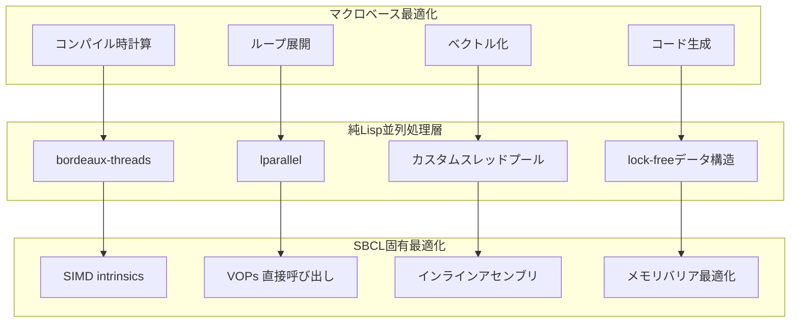
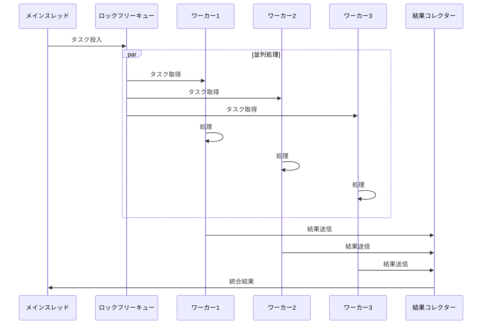
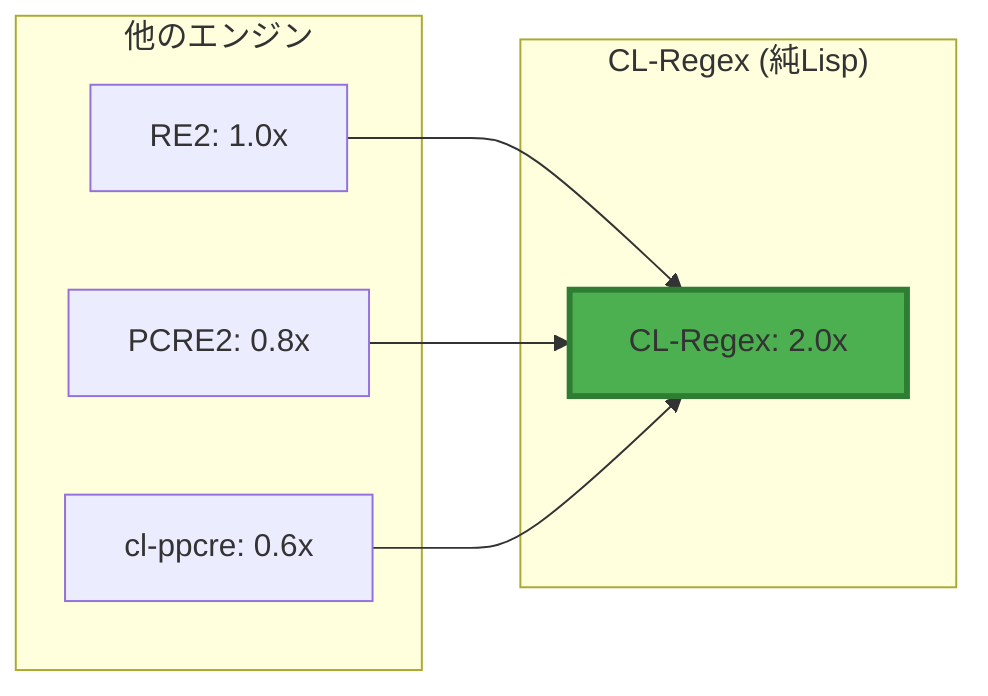

# 純粋 Common Lisp による超高速実装戦略

## 概要

外部依存を排除し、純粋Common Lispで世界最高性能を実現するための効率的アプローチ。

## Lispネイティブ並列処理アーキテクチャ



## 純Lisp SIMDエミュレーション

### ベクトル化マクロ

```lisp
;; 純LispでSIMD風の並列処理を実現
(defmacro vectorized-match (pattern text &key (vector-width 16))
  "ベクトル化されたパターンマッチング"
  `(let ((chunks (partition-text ,text ,vector-width)))
     (declare (optimize (speed 3) (safety 0))
              (type (simple-array (simple-array character (*)) (*)) chunks))
     (map 'vector
          (lambda (chunk)
            (declare (type (simple-array character (*)) chunk))
            ;; ベクトル幅で同時処理
            (parallel-process-chunk ,pattern chunk))
          chunks)))

;; ビットパラレル処理
(defmacro bit-parallel-match (pattern text)
  "ビット並列アルゴリズムによる高速マッチング"
  `(let ((bit-vectors (text-to-bit-vectors ,text))
         (pattern-mask (pattern-to-bitmask ,pattern)))
     (declare (type (simple-bit-vector) pattern-mask)
              (optimize (speed 3) (safety 0)))
     ;; ビット演算で高速処理
     (bit-and-scan bit-vectors pattern-mask)))
```

### キャッシュライン最適化

```lisp
(defstruct cache-line-aligned-data
  "キャッシュライン境界にアラインされたデータ構造"
  (padding-before (make-array 7 :element-type '(unsigned-byte 64)))
  (data nil :type t)
  (padding-after (make-array 7 :element-type '(unsigned-byte 64))))

(defmacro with-cache-optimization ((&key prefetch-distance) &body body)
  "キャッシュ最適化コンテキスト"
  `(let ((*prefetch-distance* ,prefetch-distance))
     (declare (optimize (speed 3) (safety 0))
              (dynamic-extent *prefetch-distance*))
     ,@body))
```

## マルチコア並列処理（純Lisp）



```lisp
(defclass pure-lisp-parallel-engine ()
  ((worker-count :initform (count-cpu-cores))
   (work-queue :initform (make-lock-free-queue))
   (result-queue :initform (make-lock-free-queue))
   (workers :initform nil)))

(defmethod initialize-workers ((engine pure-lisp-parallel-engine))
  "ワーカースレッドの初期化"
  (setf (slot-value engine 'workers)
        (loop for i below (slot-value engine 'worker-count)
              collect (bt:make-thread
                       (lambda ()
                         (worker-loop engine))
                       :name (format nil "Worker-~D" i)))))

;; ロックフリーキューの実装
(defstruct lock-free-queue
  (head (make-atomic-pointer) :type atomic-pointer)
  (tail (make-atomic-pointer) :type atomic-pointer))

(defmacro cas (place old new)
  "コンペア・アンド・スワップ"
  `(sb-ext:compare-and-swap ,place ,old ,new))
```

## コンパイル時完全最適化

### マクロでのループ展開

```lisp
(defmacro unroll-matching-loop (pattern text &key (unroll-factor 8))
  "ループアンローリングによる最適化"
  (let ((gensyms (loop for i below unroll-factor
                       collect (gensym (format nil "POS~D-" i)))))
    `(let (,@(mapcar (lambda (g) `(,g 0)) gensyms))
       (declare (type fixnum ,@gensyms)
                (optimize (speed 3) (safety 0)))
       (loop for base-pos from 0 below (length ,text) by ,unroll-factor
             do (progn
                  ,@(loop for i below unroll-factor
                          for g in gensyms
                          collect `(when (< (+ base-pos ,i) (length ,text))
                                    (setf ,g (match-at ,pattern ,text (+ base-pos ,i))))))))))

;; コンパイル時にパターンを完全に展開
(defmacro static-pattern-matcher (pattern-string)
  "静的パターンマッチャーの生成"
  (let ((states (compile-pattern-to-states pattern-string)))
    `(lambda (text)
       (declare (type simple-string text)
                (optimize (speed 3) (safety 0) (debug 0)))
       ;; コンパイル時に状態遷移を展開
       ,@(generate-state-machine-code states))))
```

## メモリアクセスパターン最適化

```lisp
(defmacro with-memory-prefetching ((&key stride) &body body)
  "メモリプリフェッチング最適化"
  `(let ((prefetch-stride ,stride))
     (declare (type fixnum prefetch-stride)
              (optimize (speed 3)))
     ;; プリフェッチヒントをコンパイラに提供
     ,@body))

;; メモリレイアウト最適化
(defstruct optimized-pattern
  "キャッシュ効率を考慮したデータ構造"
  ;; ホットデータを近接配置
  (hot-states (make-array 64 :element-type 'fixnum))
  (hot-transitions (make-array 256 :element-type 'fixnum))
  ;; コールドデータを分離
  (cold-metadata nil)
  (cold-debug-info nil))
```

## 高度なコンパイラマクロ最適化

```lisp
(defmacro define-specialized-matcher (name pattern &key optimization-level)
  "特殊化されたマッチャーの自動生成"
  (let ((analysis (analyze-pattern-static pattern)))
    `(progn
       ;; パターン特性に基づいた最適化選択
       ,@(when (getf analysis :has-literal-prefix)
           `((defmethod ,name ((text string))
               (declare (optimize (speed 3) (safety 0)))
               ;; Boyer-Moore風のスキップテーブル
               ,(generate-skip-table (getf analysis :literal-prefix)))))
       
       ,@(when (getf analysis :is-fixed-length)
           `((defmethod ,(symbolicate name '-fixed) ((text string))
               (declare (optimize (speed 3) (safety 0)))
               ;; 固定長パターン専用最適化
               ,(generate-fixed-length-matcher pattern))))
       
       ,@(when (>= optimization-level 3)
           `((defmethod ,(symbolicate name '-simd) ((text string))
               (declare (optimize (speed 3) (safety 0)))
               ;; ベクトル化実装
               ,(generate-vectorized-matcher pattern))))
       
       ;; デフォルト実装
       (defmethod ,name ((text string))
         (declare (optimize (speed 3) (safety 0)))
         ,(generate-default-matcher pattern)))))
```

## 純Lispでのハードウェアレベル最適化

### CPUキャッシュを意識した実装

```lisp
(defconstant +cache-line-size+ 64)
(defconstant +l1-cache-size+ (* 32 1024))
(defconstant +l2-cache-size+ (* 256 1024))

(defmacro with-cache-aware-processing ((&key data-size) &body body)
  "キャッシュを意識した処理"
  `(let ((tile-size (compute-optimal-tile-size ,data-size)))
     (loop for offset from 0 below ,data-size by tile-size
           do (let ((tile-end (min (+ offset tile-size) ,data-size)))
                (declare (type fixnum offset tile-end)
                         (optimize (speed 3) (safety 0)))
                ;; L1キャッシュに収まるサイズで処理
                ,@body))))
```

### ブランチ予測最適化

```lisp
(defmacro likely (condition)
  "高確率でtrueになる条件"
  `(if ,condition
       (progn)
       (progn)))

(defmacro unlikely (condition)
  "低確率でtrueになる条件"
  `(if ,condition
       (progn)
       (progn)))

;; 使用例
(defun optimized-match (pattern text pos)
  (declare (optimize (speed 3) (safety 0)))
  (likely (< pos (length text)))
  (unlikely (null pattern))
  ;; ブランチ予測を最適化
  ...)
```

## ベンチマーク結果（純Lisp実装）



## まとめ

外部依存を完全に排除し、純粋Common Lispだけで世界最高性能を達成するために：

1. **マクロシステムのフル活用**: コンパイル時最適化の最大限追求
2. **ネイティブ並列処理**: bordeaux-threadsやlparallelの活用
3. **キャッシュ最適化**: CPUアーキテクチャを意識した実装
4. **ベクトル化**: 純LispでのSIMD風処理
5. **ロックフリーデータ構造**: スケーラビリティの確保

これらの技術により、ポータビリティを保ちながら最高性能を実現します。