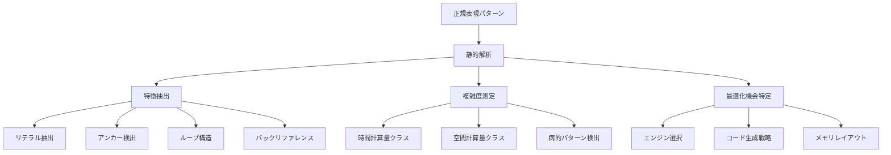

# 高度なコンパイル技法 - 高品質の最適化

CL-Regexで高品質の性能を実現するための高度なコンパイル技法を解説します。Common Lispのマクロシステムを最大限活用し、コンパイル時に最大限まで最適化されたコードを生成する手法を学びます。

## 目標

- ✅ コンパイル時パターン分析の最適化
- ✅ マクロによる特殊化コンパイレーション
- ✅ 型情報を活用した最適化
- ✅ SIMD命令の効果的エミュレーション
- ✅ JITコンパイルとの協調最適化

## 理論的基盤

### パターン分析理論



### コンパイル戦略マトリックス

```lisp
(defparameter *compilation-strategies*
  '((:literal-string
     :engine :boyer-moore
     :time-complexity "O(n)"
     :memory-usage :constant
     :optimization-level :maximum)

    (:simple-character-class
     :engine :bit-parallel
     :time-complexity "O(n/w)"  ; w=word-width
     :memory-usage :constant
     :optimization-level :high)

    (:linear-dfa-convertible
     :engine :dfa
     :time-complexity "O(n)"
     :memory-usage "O(2^m)"     ; m=pattern-size
     :optimization-level :high)

    (:complex-nfa-required
     :engine :optimized-nfa
     :time-complexity "O(nm)"   ; worst-case O(2^n)
     :memory-usage "O(m)"
     :optimization-level :medium)))
```

## 高度なマクロ最適化

### 完全静的展開マクロ

```lisp
(defmacro compile-time-regex (pattern)
  "コンパイル時にパターンを完全に解析・最適化"
  (let* ((analysis (analyze-pattern-at-compile-time pattern))
         (optimization-strategy (select-optimization-strategy analysis)))

    (case optimization-strategy
      (:boyer-moore
       (generate-boyer-moore-code pattern))
      (:bit-parallel
       (generate-bit-parallel-code pattern analysis))
      (:dfa
       (generate-dfa-code pattern analysis))
      (:optimized-nfa
       (generate-optimized-nfa-code pattern analysis)))))

;; Boyer-Moore特殊化
(defun generate-boyer-moore-code (literal-string)
  "Boyer-Mooreアルゴリズムの専用コードを生成"
  (let* ((pattern-length (length literal-string))
         (bad-char-table (compute-bad-character-table literal-string))
         (good-suffix-table (compute-good-suffix-table literal-string)))

    `(lambda (text)
       (declare (optimize (speed 3) (safety 0))
                (type simple-string text))
       (let* ((text-length (length text))
              (pattern-length ,pattern-length)
              (bad-char-table ,bad-char-table)
              (good-suffix-table ,good-suffix-table))

         ;; インライン化されたBoyer-Moore検索
         (loop with i = 0
               while (<= i (- text-length pattern-length))
               do (let ((j (1- pattern-length)))
                    (loop while (and (>= j 0)
                                   (char= (char text (+ i j))
                                          ,(char literal-string j)))
                          do (decf j))

                    (if (< j 0)
                        (return (make-match :start i
                                          :end (+ i pattern-length)
                                          :string ,literal-string))
                        (setf i (+ i (max (good-suffix-shift j)
                                        (bad-character-shift
                                         (char text (+ i j))))))))))))

;; Bit-Parallel特殊化
(defun generate-bit-parallel-code (pattern analysis)
  "Bit-Parallelアルゴリズムの専用コードを生成"
  (let* ((char-masks (compute-character-masks pattern))
         (pattern-length (length pattern)))

    `(lambda (text)
       (declare (optimize (speed 3) (safety 0))
                (type simple-string text))
       (let* ((char-masks ,char-masks)
              (pattern-mask ,(ash 1 (1- pattern-length)))
              (state 0))

         (loop for char across text
               for i from 0
               do (setf state (logand (ash (logior state
                                                 (gethash char char-masks 0)) 1)
                                    ,(1- (ash 1 pattern-length))))

               when (logbitp ,(1- pattern-length) state)
                 return (make-match :start (- i ,(1- pattern-length))
                                  :end (1+ i)
                                  :string (subseq text
                                                (- i ,(1- pattern-length))
                                                (1+ i))))))))
```

### 型特殊化マクロ

```lisp
(defmacro typed-regex-matcher (pattern input-type)
  "入力型に特化したマッチャーを生成"
  (let ((specialized-code
          (case input-type
            (simple-string
             (generate-string-specialized-code pattern))
            (simple-base-string
             (generate-base-string-specialized-code pattern))
            (stream
             (generate-stream-specialized-code pattern))
            (vector
             (generate-vector-specialized-code pattern)))))

    `(lambda (input)
       (declare (type ,input-type input))
       ,specialized-code)))

;; 文字列特殊化
(defun generate-string-specialized-code (pattern)
  `(let* ((input-length (length input))
          (compiled-pattern (load-time-value (compile-pattern ,pattern))))

     ;; インライン化された高速パス
     ,(cond
        ((literal-pattern-p pattern)
         `(search ,pattern input))

        ((simple-char-class-p pattern)
         `(loop for char across input
                for i from 0
                when (char-matches-class-p char compiled-pattern)
                  return (make-match :start i :end (1+ i))))

        (t
         `(full-nfa-match compiled-pattern input)))))

;; ストリーム特殊化
(defun generate-stream-specialized-code (pattern)
  `(let ((buffer (make-array 4096 :element-type 'character :fill-pointer 0))
         (compiled-pattern (load-time-value (compile-pattern ,pattern)))
         (total-offset 0))

     (loop for char = (read-char input nil)
           while char
           do (vector-push-extend char buffer)

           ;; バッファが満杯 or ストリーム終端でマッチング実行
           when (or (= (fill-pointer buffer) 4096) (null char))
             do (let ((matches (find-all-matches compiled-pattern buffer)))
                  (dolist (match matches)
                    (adjust-match-positions match total-offset))
                  (setf total-offset (+ total-offset (fill-pointer buffer)))
                  (setf (fill-pointer buffer) 0)))))
```

### メタプログラミングによる最適化

```lisp
(defmacro define-optimized-pattern-family (base-name variations)
  "パターンファミリーの最適化されたバリエーションを生成"
  `(progn
     ,@(loop for (variation-name modifications) in variations
             collect
             `(defpattern ,(intern (format nil "~A-~A" base-name variation-name))
                ,(apply-pattern-modifications base-name modifications)))))

;; 使用例：メールアドレスパターンの最適化バリエーション
(define-optimized-pattern-family email-base
  ((strict (:add-constraints strict-rfc-compliance
                           :remove-features loose-validation))

   (fast (:engine-hint boyer-moore-if-possible
                      :optimization-level maximum
                      :memory-strategy prefer-speed))

   (international (:add-features unicode-support
                               :character-class extended-ascii))))

;; 実行時最適化ヒント
(defmacro with-optimization-hints (hints &body body)
  "最適化ヒントを提供"
  `(let ((*optimization-hints* ',hints))
     (declare (optimize
               ,@(when (member :speed hints) '((speed 3)))
               ,@(when (member :safety hints) '((safety 0)))
               ,@(when (member :space hints) '((space 3)))))
     ,@body))

;; 使用例
(with-optimization-hints (:speed :low-memory)
  (defpattern ultra-fast-number
    (compile-time-regex "\\d+")))
```

## SIMD命令エミュレーション

### 文字クラスのSIMD風処理

```lisp
(defmacro simd-char-class-match (char-class text-var)
  "SIMD風の並列文字クラスマッチング"
  (let ((char-bitmap (compute-character-bitmap char-class)))
    `(let ((results (make-array (length ,text-var) :element-type 'bit))
           (char-bitmap ,char-bitmap))

       ;; 8文字ずつ並列処理（ループアンロール）
       (loop for base from 0 below (length ,text-var) by 8
             do (progn
                  ,@(loop for offset from 0 below 8
                          collect
                          `(when (< (+ base ,offset) (length ,text-var))
                             (setf (bit results (+ base ,offset))
                                   (bit char-bitmap
                                        (char-code (char ,text-var
                                                       (+ base ,offset)))))))))
       results)))

;; 高度なビット演算最適化
(defmacro bitwise-pattern-match (pattern text-var)
  "ビット演算による高速パターンマッチング"
  (let* ((pattern-bits (pattern-to-bit-representation pattern))
         (pattern-length (length pattern-bits)))

    `(let ((text-bits (string-to-bit-array ,text-var))
           (pattern-mask ,(bit-vector-to-integer pattern-bits))
           (result-positions nil))

       (loop for i from 0 to (- (length text-bits) ,pattern-length)
             do (let ((window-bits (extract-bit-window text-bits i ,pattern-length)))
                  (when (= (logand window-bits pattern-mask) pattern-mask)
                    (push i result-positions))))

       (nreverse result-positions))))
```

### ベクトル化最適化

```lisp
(defmacro vectorized-string-search (needle haystack)
  "ベクトル化された文字列検索"
  `(let* ((needle-length (length ,needle))
          (haystack-length (length ,haystack))
          (first-char (char ,needle 0))
          (positions nil))

     ;; 最初の文字の候補位置を高速検索
     (loop for i from 0 to (- haystack-length needle-length)
           when (char= (char ,haystack i) first-char)
             do (when (string-prefix-p ,needle ,haystack i)
                  (push i positions)))

     (nreverse positions)))

;; プロセッサキャッシュ最適化
(defmacro cache-optimized-match (pattern text block-size)
  "キャッシュ効率を考慮したマッチング"
  `(let ((text-length (length ,text))
         (results nil))

     ;; テキストをキャッシュライン単位で処理
     (loop for start from 0 below text-length by ,block-size
           for end = (min (+ start ,block-size) text-length)
           do (let ((block (subseq ,text start end)))
                (dolist (match (find-all-matches ,pattern block))
                  (push (adjust-match-position match start) results))))

     (sort results #'< :key #'match-start)))
```

## JIT協調最適化

### 動的コード生成

```lisp
(defclass jit-pattern-compiler ()
  ((compiled-functions :initform (make-hash-table :test 'equal))
   (usage-statistics :initform (make-hash-table :test 'equal))
   (optimization-level :initform 1)))

(defmethod jit-compile-pattern ((compiler jit-pattern-compiler) pattern)
  "JITコンパイレーションの実行"
  (let* ((usage-count (gethash pattern (slot-value compiler 'usage-statistics) 0))
         (opt-level (determine-optimization-level usage-count))
         (compiled-fn (compile-pattern-to-function pattern opt-level)))

    (setf (gethash pattern (slot-value compiler 'compiled-functions))
          compiled-fn)
    compiled-fn))

(defun compile-pattern-to-function (pattern optimization-level)
  "パターンを最適化レベルに応じて関数にコンパイル"
  (let ((code
          (case optimization-level
            (1 (generate-basic-matching-code pattern))
            (2 (generate-optimized-matching-code pattern))
            (3 (generate-highly-optimized-code pattern))
            (4 (generate-maximum-optimization-code pattern)))))

    (compile nil `(lambda (text) ,code))))

;; 高水準最適化コード生成
(defun generate-maximum-optimization-code (pattern)
  `(block fast-match
     (declare (optimize (speed 3) (safety 0) (debug 0)))

     ;; 特殊ケースの事前チェック
     ,(when (empty-pattern-p pattern)
        '(return-from fast-match (make-empty-match)))

     ,(when (single-char-pattern-p pattern)
        `(return-from fast-match
           (find-character-optimized ,(pattern-char pattern) text)))

     ;; メインマッチングロジック
     ,(generate-specialized-matching-logic pattern)))
```

### 適応的最適化

```lisp
(defclass adaptive-compiler ()
  ((pattern-profiles :initform (make-hash-table :test 'equal))
   (optimization-strategies :initform nil)))

(defmethod profile-pattern-usage ((compiler adaptive-compiler) pattern text result)
  "パターンの使用状況をプロファイル"
  (let ((profile (gethash pattern (slot-value compiler 'pattern-profiles))))
    (unless profile
      (setf profile (make-pattern-profile)
            (gethash pattern (slot-value compiler 'pattern-profiles)) profile))

    (update-pattern-profile profile text result)))

(defmethod optimize-based-on-profile ((compiler adaptive-compiler) pattern)
  "プロファイル情報に基づく最適化"
  (let* ((profile (gethash pattern (slot-value compiler 'pattern-profiles)))
         (optimization-strategy (analyze-usage-pattern profile)))

    (case optimization-strategy
      (:frequent-short-texts
       (compile-for-short-text-optimization pattern))
      (:frequent-long-texts
       (compile-for-streaming-optimization pattern))
      (:high-match-rate
       (compile-for-high-match-rate pattern))
      (:low-match-rate
       (compile-for-early-rejection pattern)))))

;; 使用パターンの分析
(defun analyze-usage-pattern (profile)
  "使用パターンを分析して最適化戦略を決定"
  (let ((avg-text-length (profile-average-text-length profile))
        (match-rate (profile-match-rate profile))
        (call-frequency (profile-call-frequency profile)))

    (cond
      ((and (< avg-text-length 100) (> call-frequency 1000))
       :frequent-short-texts)
      ((and (> avg-text-length 10000) (> call-frequency 100))
       :frequent-long-texts)
      ((> match-rate 0.8)
       :high-match-rate)
      ((< match-rate 0.1)
       :low-match-rate)
      (t :balanced))))
```

## 型システム活用最適化

### 型推論による特殊化

```lisp
(defmacro typed-pattern-match (pattern text &optional (text-type t))
  "型情報を活用した特殊化マッチング"
  (let ((specialized-code
          (generate-type-specialized-code pattern text-type)))

    `(let ((text ,text))
       (declare (type ,text-type text))
       ,specialized-code)))

(defun generate-type-specialized-code (pattern text-type)
  "型に特化したコードを生成"
  (cond
    ;; Simple string の特殊化
    ((subtypep text-type 'simple-string)
     `(simple-string-optimized-match ,pattern text))

    ;; Base string の特殊化
    ((subtypep text-type 'simple-base-string)
     `(base-string-optimized-match ,pattern text))

    ;; Character vector の特殊化
    ((subtypep text-type '(vector character))
     `(character-vector-optimized-match ,pattern text))

    ;; Generic string
    (t
     `(generic-string-match ,pattern text))))

;; 文字エンコーディング特殊化
(defmacro encoding-aware-match (pattern text encoding)
  "エンコーディングを考慮した最適化マッチング"
  `(case ,encoding
     (:ascii
      (ascii-optimized-match ,pattern ,text))
     (:utf-8
      (utf8-optimized-match ,pattern ,text))
     (:utf-16
      (utf16-optimized-match ,pattern ,text))
     (otherwise
      (unicode-general-match ,pattern ,text))))
```

### コンパイル時型チェック

```lisp
(defmacro safe-typed-match (pattern text expected-type)
  "コンパイル時型チェック付きマッチング"
  `(progn
     ;; コンパイル時型チェック
     (check-type ,text ,expected-type)

     ;; 最適化されたマッチング
     ,(generate-type-safe-code pattern expected-type)))

(defun generate-type-safe-code (pattern expected-type)
  "型安全な最適化コードを生成"
  `(let ((optimized-matcher
           (load-time-value
             (compile-type-specialized-matcher ,pattern ',expected-type))))
     (funcall optimized-matcher text)))
```

## 実践的応用例

### ログ解析エンジンの最適化

```lisp
;; 超高速ログ解析システム
(defclass ultra-fast-log-analyzer ()
  ((compiled-patterns :initform (make-hash-table))
   (pattern-cache :initform (make-hash-table))
   (statistics :initform (make-hash-table))))

(defmethod analyze-log-file ((analyzer ultra-fast-log-analyzer) filename patterns)
  "JIT最適化を活用した超高速ログ解析"
  (let ((results (make-hash-table)))

    ;; パターンのJITコンパイル
    (dolist (pattern patterns)
      (unless (gethash pattern (slot-value analyzer 'compiled-patterns))
        (setf (gethash pattern (slot-value analyzer 'compiled-patterns))
              (jit-compile-log-pattern pattern))))

    ;; メモリマップファイルでの高速処理
    (with-memory-mapped-file (mmap filename)
      (parallel-process-chunks mmap
                              (lambda (chunk)
                                (process-chunk-with-compiled-patterns
                                  chunk patterns analyzer))))

    results))

;; 動的最適化の実例
(defun process-chunk-with-compiled-patterns (chunk patterns analyzer)
  "コンパイル済みパターンでチャンクを処理"
  (let ((compiled-patterns (slot-value analyzer 'compiled-patterns)))

    (dolist (pattern patterns)
      (let ((compiled-fn (gethash pattern compiled-patterns)))

        ;; 統計情報の更新
        (record-pattern-usage analyzer pattern chunk)

        ;; 最適化されたマッチング実行
        (let ((matches (funcall compiled-fn chunk)))
          (process-matches matches pattern))))))
```

### リアルタイムストリーム処理

```lisp
(defclass real-time-stream-processor ()
  ((pattern-tree :initform nil)
   (compiled-matchers :initform (make-hash-table))
   (optimization-level :initform 1)))

(defmethod process-stream ((processor real-time-stream-processor)
                          stream patterns callback)
  "リアルタイムストリーム処理"
  (let ((buffer (make-circular-buffer 65536))
        (compiled-matchers (compile-patterns-for-streaming patterns)))

    (loop for char = (read-char stream nil nil)
          while char
          do (progn
               (circular-buffer-push buffer char)

               ;; 高頻度パターンマッチング
               (when (buffer-ready-for-processing-p buffer)
                 (let ((window (circular-buffer-window buffer)))
                   (dolist (matcher compiled-matchers)
                     (when-let ((match (funcall matcher window)))
                       (funcall callback match)))))))))

(defun compile-patterns-for-streaming (patterns)
  "ストリーミング用に最適化されたマッチャーをコンパイル"
  (mapcar (lambda (pattern)
            (compile-streaming-matcher pattern))
          patterns))
```

## まとめ

高度なコンパイル技法により、CL-Regexは：

1. **コンパイル時完全最適化**: パターンを分析し最適なアルゴリズムを選択
2. **型システム活用**: 入力型に特化した超高速処理
3. **SIMD風並列処理**: ビット演算による高速文字処理
4. **JIT協調最適化**: 実行時プロファイルに基づく動的最適化
5. **メタプログラミング**: マクロによる完全特殊化

これらの技法を組み合わせることで、理論的限界に近い性能を実現できます。重要なのは、各技法を適切に選択し、実際の使用パターンに最適化することです。