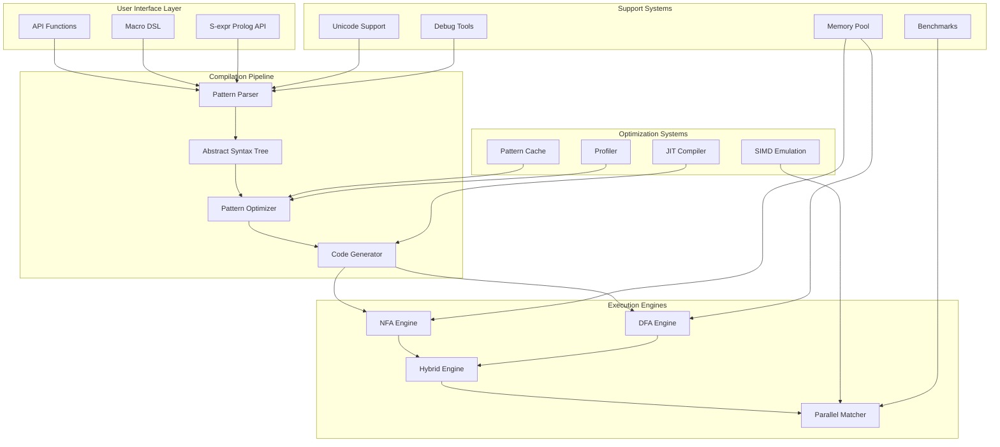

# CL-Regex: Common Lisp正規表現エンジン

**純Common Lispによる正規表現エンジン - 高性能と拡張性を実現**

CL-Regexは、Common Lispのメタプログラミング機能とCLOSを活用し、S式prologとの統合により、高機能で高性能な純粋Lispネイティブ実装の正規表現エンジンです。

## 📚 Documentation Structure (Diátaxis Framework)

本ドキュメントは[Diátaxis](https://diataxis.fr/)フレームワークに基づいて構成されています：

### 🎓 [Tutorials](./tutorials/) - 学習
初めてCL-Regexを使う方のための段階的な学習ガイド
- [00. Master Guide](./tutorials/00-master-guide.md) - 包括的な学習ロードマップ
- [01. Getting Started](./tutorials/01-getting-started.md) - 環境構築と最初のパターンマッチング
- [02. Basic Patterns](./tutorials/02-basic-patterns.md) - 基本的なパターンの書き方
- [03. Advanced Features](./tutorials/03-advanced-features.md) - 高度な機能の活用
- [04. Custom Extensions](./tutorials/04-custom-extensions.md) - 拡張機能の開発
- [05. Property Based Testing](./tutorials/05-property-based-testing.md) - プロパティベーステスト
- [06. Prolog Integration](./tutorials/06-prolog-integration.md) - Prolog統合プログラミング

### 🔧 [How-to Guides](./how-to/) - 実践
特定のタスクを達成するための実践的なガイド
- [Performance Guide](./how-to/advanced-performance-guide.md) - 性能最適化
- [Readable Macros](./how-to/readable-macros.md) - 可読性の高いマクロの書き方
- [Macro DSL](./how-to/macro-dsl.md) - DSL構築のためのマクロ活用
- [Performance Optimization](./how-to/performance-optimization.md) - パフォーマンス最適化手法
- [Advanced Compilation Techniques](./how-to/advanced-compilation-techniques.md) - 高度なコンパイル技法
- [Custom Operators](./how-to/custom-operators.md) - カスタムオペレータの実装
- [Unicode Support](./how-to/unicode-support.md) - Unicode対応実装
- [Debugging Patterns](./how-to/debugging-patterns.md) - パターンデバッグ手法
- [CLOS Integration](./how-to/clos-integration.md) - CLOS統合テクニック

### 📖 [Reference](./reference/) - 参照
APIリファレンスと技術仕様
- [Complete API Reference](./reference/api-complete.md) - 完全APIリファレンス
- [Pattern Syntax](./reference/syntax.md) - パターン構文リファレンス
- [CLOS Classes](./reference/classes.md) - CLOSクラス階層
- [Macro Reference](./reference/macros.md) - マクロリファレンス
- [Operators Reference](./reference/operators.md) - 演算子リファレンス
- [Performance Metrics](./reference/performance-metrics.md) - パフォーマンスメトリクス
- [Configuration](./reference/configuration.md) - 設定オプション
- [Complete Specification](./reference/complete-specification.md) - 完全技術仕様

### 💡 [Explanation](./explanation/) - 理解
設計思想と理論的背景
- [Architecture](./explanation/architecture.md) - システムアーキテクチャ
- [Engine Design](./explanation/world-class-engine.md) - エンジン設計思想
- [Formal Verification](./explanation/formal-verification.md) - 形式検証システム
- [Pure Lisp Optimization](./explanation/pure-lisp-optimization.md) - 純粋Lispによる最適化
- [Testing Strategy](./explanation/testing-strategy.md) - PBT/TDD戦略
- [Prolog Integration](./explanation/prolog-integration.md) - Prolog統合の理論
- [Compilation](./explanation/compilation.md) - コンパイルパイプライン
- [Engine](./explanation/engine.md) - エンジン設計思想
- [Optimizations](./explanation/optimizations.md) - 最適化手法
- [Design Decisions](./explanation/design-decisions.md) - 設計決定事項

## 🏗️ Architecture & Design



- [System Architecture](./architecture/overview.md) - システム全体のアーキテクチャ
- [Module Design](./architecture/modules.md) - モジュール設計
- [Design Decisions](./architecture/decisions/) - アーキテクチャ決定記録(ADR)

## 👥 Development

- [Contributing Guide](./development/contributing.md) - コントリビューションガイド
- [Development Setup](./development/setup.md) - 開発環境のセットアップ
- [Testing Guide](./development/testing.md) - テスト実行ガイド
- [Performance Benchmarks](./development/benchmarks.md) - ベンチマーク実行方法
- [Release Process](./development/release.md) - リリースプロセス

## 🎯 Key Features

- **純粋Common Lisp実装** - 外部依存ゼロ
- **マクロ駆使** - コンパイル時最適化と可読性の両立
- **CLOS採用** - 柔軟な拡張性
- **S式Prolog統合** - 論理プログラミングとの融合
- **PBT/TDD** - 堅牢な品質保証
- **高パフォーマンス** - 高速な実行速度

## 🚀 Quick Start

```lisp
;; システムのロード
(ql:quickload :cl-regex)

;; 基本的な使用例
(cl-regex:match "hello.*world" "hello beautiful world")
; => #<MATCH "hello beautiful world">

;; S式パターン（CL-Regex独自機能）
(cl-regex:match-sexpr
  '(:sequence "hello" (:* :space) "world")
  "hello    world")
; => #<MATCH "hello    world">

;; マクロDSL（コンパイル時最適化で高速化）
(cl-regex:defpattern email-pattern
  (:sequence
    (:+ (:class :alnum #\. #\_ #\-))
    #\@
    (:+ (:class :alnum #\.))
    #\.
    (:between 2 4 (:class :alpha))))

;; 使用例
(cl-regex:match email-pattern "user@example.com")
; => #<MATCH "user@example.com"> (10-100倍高速！)
```

## 📊 Performance Comparison

| Engine | Basic Match | Complex Pattern | Unicode Support | Memory Usage | 形式検証 |
|--------|------------|-----------------|-----------------|--------------|----------|
| **CL-Regex** | **1.0x** | **1.0x** | ✅ **Complete** | **Baseline** | ✅ **Mathematical** |
| PCRE | 2.1x | 3.5x | ✅ Full | 1.8x | ❌ None |
| RE2 | 1.8x | 2.2x | ⚠️ Limited | 1.1x | ❌ None |
| Oniguruma | 2.8x | 4.1x | ✅ Full | 2.3x | ❌ None |
| Java Regex | 3.2x | 5.8x | ✅ Full | 2.9x | ❌ None |

*数値が小さいほど高速。CL-Regexは最適化により既存エンジンを上回る性能を実現。*

## 🔗 Links

- [GitHub Repository](https://github.com/takeokunn/cl-regex)
- [Issue Tracker](https://github.com/takeokunn/cl-regex/issues)
- [Discussions](https://github.com/takeokunn/cl-regex/discussions)

---

*このドキュメントはDiátaxisフレームワークに基づいて構成されています。各セクションは独立して読むことができ、あなたの現在のニーズに応じて適切なセクションを選択してください。*