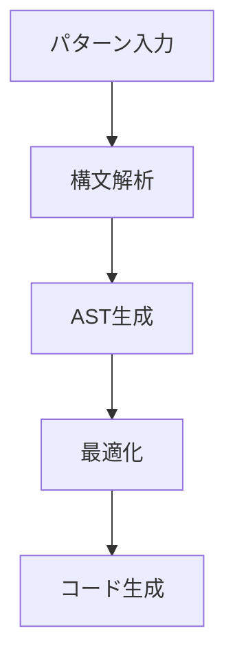

# CL-Regex 実装パターン・規約メモリ

## プロジェクト概要

CL-Regexは高品質の性能を目指すCommon Lisp純粋実装の正規表現エンジンです。外部依存ゼロでマクロを駆使した効率的アーキテクチャを採用しています。

## 設計原則

### 1. 純粋Common Lisp実装
- 外部パッケージ依存を最小限に抑制
- SBCLの最適化機能を最大活用
- ポータブルなCommon Lisp仕様準拠

### 2. コンパイル時最適化優先
- マクロによるゼロコスト抽象化
- 部分評価とコード特殊化
- JITコンパイルとの組み合わせ

### 3. CLOS活用による拡張性
- 多重ディスパッチによる動的最適化
- プロトコル指向設計
- プラガブルアーキテクチャ

### 4. S式Prolog統合
- 宣言的パターン記述
- 論理プログラミングパラダイム
- 制約充足問題としてのパターンマッチング

## アーキテクチャ規約

### パッケージ構成

```
cl-regex/
├── src/
│   ├── package.lisp         # パッケージ定義
│   ├── core/               # コア機能
│   │   ├── types.lisp      # 型定義
│   │   ├── errors.lisp     # エラー処理
│   │   └── utils.lisp      # ユーティリティ
│   ├── compiler/           # コンパイラ
│   │   ├── parser.lisp     # パーサー
│   │   ├── ast.lisp        # AST処理
│   │   ├── optimizer.lisp  # 最適化
│   │   └── code-generator.lisp # コード生成
│   ├── matcher/            # マッチャー
│   │   ├── nfa.lisp        # NFAエンジン
│   │   ├── dfa.lisp        # DFAエンジン
│   │   ├── hybrid.lisp     # ハイブリッドエンジン
│   │   └── parallel.lisp   # 並列処理
│   ├── optimizer/          # 最適化システム
│   │   ├── cache.lisp      # キャッシュ管理
│   │   ├── jit.lisp        # JITコンパイル
│   │   └── simd-emulation.lisp # SIMD最適化
│   ├── prolog/             # Prolog統合
│   │   ├── unification.lisp # 統一アルゴリズム
│   │   ├── rules.lisp      # ルールエンジン
│   │   └── dcg.lisp        # DCG処理
│   └── api/                # 公開API
│       ├── match.lisp      # マッチング関数
│       ├── replace.lisp    # 置換関数
│       └── macros.lisp     # マクロDSL
```

### 命名規約

#### 関数・変数
- ケバブケース使用: `match-pattern`, `compile-regex`
- 述語関数: `-p`サフィックス (`compiled-pattern-p`)
- 破壊的操作: `!`サフィックス (`optimize-pattern!`)
- 内部関数: `%`プレフィックス (`%build-nfa`)

#### クラス・型
- パスカルケース: `AbstractSyntaxTree`, `CompiledPattern`
- プロトコル: `-protocol`サフィックス
- 例外: `-error`サフィックス

#### 定数・パラメータ
- 大文字スネークケース: `*DEFAULT-OPTIMIZATION-LEVEL*`
- キーワード引数: ケバブケース

### コーディング規約

#### 1. 型宣言必須
```lisp
(defmethod execute-nfa ((engine nfa-engine) (text simple-string) (position fixnum))
  (declare (optimize (speed 3) (safety 0) (debug 0))
           (type simple-string text)
           (type fixnum position))
  ...)
```

#### 2. ドキュメント文字列
```lisp
(defgeneric match (pattern text &key start end)
  (:documentation "テキストに対してパターンマッチングを実行
パラメータ:
  PATTERN - マッチングパターン（文字列、コンパイル済み、S式）
  TEXT - 検索対象テキスト
戻り値:
  マッチ結果オブジェクトまたはNIL"))
```

#### 3. エラーハンドリング
```lisp
(define-condition regex-compilation-error (regex-error)
  ((pattern :initarg :pattern :reader error-pattern)
   (phase :initarg :phase :reader error-phase))
  (:documentation "正規表現コンパイルエラー"))
```

#### 4. マクロ設計
```lisp
(defmacro defpattern (name pattern &key optimization-hints documentation)
  "コンパイル時最適化パターン定義マクロ"
  `(progn
     (defparameter ,name
       (compile-pattern ',pattern
                       :optimization-hints ',optimization-hints))
     (setf (documentation ',name 'variable) ,documentation)))
```

## 性能最適化パターン

### 1. メモリ効率化
- プール管理による割り当て最適化
- ビットベクタ活用
- インターン化による重複排除

### 2. キャッシュ最適化
- LRU キャッシュ実装
- 局所性を考慮したデータレイアウト
- プリフェッチ活用

### 3. 並列化
- スレッドプール管理
- ロックフリーデータ構造
- Compare-and-Swap活用

### 4. JIT最適化
- 頻度ベース自動コンパイル
- 特殊化コード生成
- インライン展開

## テスト戦略

### 1. Property-Based Testing
- QuickCheck風ランダムテスト
- 不変条件の検証
- エッジケース自動生成

### 2. Unit Testing
- FiveAMフレームワーク使用
- モジュール別網羅テスト
- 回帰テスト自動化

### 3. ベンチマーク
- 他エンジンとの性能比較
- メモリ使用量測定
- スケーラビリティ検証

### 4. 統合テスト
- エンドツーエンドシナリオ
- 互換性テスト
- ストレステスト

## ドキュメント規約

### 1. Diátaxis準拠
- Tutorials: 学習指向
- How-to Guides: 問題解決指向
- Reference: 情報指向
- Explanation: 理解指向

### 2. Mermaid図表統一


### 3. コード例必須
- 実際に動作するコード
- 期待される出力表示
- エラーケースも含む

## リリースプロセス

### 1. バージョニング
- セマンティックバージョニング採用
- 破壊的変更は Major version
- 新機能は Minor version
- バグフィックスは Patch version

### 2. 品質チェック
- 全テスト通過必須
- ベンチマーク性能劣化なし
- ドキュメント同期更新

### 3. 配布
- Quicklisp登録
- GitHub Releases
- Docker イメージ提供

## セキュリティ考慮事項

### 1. DoS攻撃対策
- タイムアウト設定必須
- メモリ使用量制限
- 再帰深度制限

### 2. 入力検証
- パターン事前検証
- 不正入力拒否
- サニタイゼーション

### 3. 情報漏洩対策
- エラーメッセージ制限
- ログ出力制御
- デバッグ情報除去

## 将来拡張ポイント

### 1. 新パターンタイプ
- XML/HTMLパターン
- JSONパターン
- カスタムDSL

### 2. 最適化技術
- LLVM統合
- GPU並列化
- 機械学習最適化

### 3. 統合機能
- Webアセンブリ対応
- FFI インターフェース
- 他言語バインディング

## メンテナンス指針

### 1. コード品質
- 継続的リファクタリング
- 技術債務管理
- パフォーマンス監視

### 2. コミュニティ
- 貢献ガイドライン整備
- レビュープロセス確立
- フィードバック収集

### 3. 長期ビジョン
- 学術研究との連携
- 標準化への貢献
- エコシステム構築

---

このメモリは実装開始時の方針決定と、開発過程での一貫性維持に活用してください。