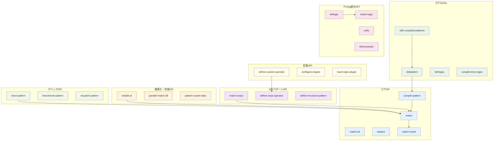

# CL-Regex 完全API リファレンス

高品質の性能を誇るCL-Regexの全API機能を網羅的に解説します。

## API全体図



## 目次

### [1. コアAPI](#1-コアapi)
- [1.1 基本マッチング](#11-基本マッチング)
- [1.2 パターンコンパイル](#12-パターンコンパイル)
- [1.3 結果オブジェクト](#13-結果オブジェクト)

### [2. S式パターンAPI](#2-s式パターンapi)
- [2.1 構造化パターン定義](#21-構造化パターン定義)
- [2.2 高度なS式機能](#22-高度なs式機能)
- [2.3 再帰パターン](#23-再帰パターン)

### [3. マクロDSL](#3-マクロdsl)
- [3.1 コンパイル時最適化](#31-コンパイル時最適化)
- [3.2 パターン定義マクロ](#32-パターン定義マクロ)
- [3.3 条件コンパイル](#33-条件コンパイル)

### [4. 最適化・性能API](#4-最適化性能api)
- [4.1 JITコンパイル](#41-jitコンパイル)
- [4.2 並列実行](#42-並列実行)
- [4.3 キャッシュ制御](#43-キャッシュ制御)

### [5. Prolog統合API](#5-prolog統合api)
- [5.1 論理パターン](#51-論理パターン)
- [5.2 統一・バックトラック](#52-統一バックトラック)
- [5.3 制約充足](#53-制約充足)

### [6. デバッグ・プロファイリングAPI](#6-デバッグプロファイリングapi)
- [6.1 実行時解析](#61-実行時解析)
- [6.2 性能測定](#62-性能測定)
- [6.3 可視化ツール](#63-可視化ツール)

### [7. 拡張・設定API](#7-拡張設定api)
- [7.1 カスタムオペレータ](#71-カスタムオペレータ)
- [7.2 エンジン設定](#72-エンジン設定)
- [7.3 プラグインシステム](#73-プラグインシステム)

### [8. エラーハンドリング](#8-エラーハンドリング)
- [8.1 例外階層](#81-例外階層)
- [8.2 エラー回復](#82-エラー回復)

---

## 1. コアAPI

### 1.1 基本マッチング

#### `match` - 基本パターンマッチング

```lisp
(defgeneric match (pattern text &key start end case-sensitive-p engine-hint timeout)
  (:documentation "テキストに対してパターンマッチングを実行"))
```

**パラメータ:**
- `pattern` - マッチングパターン（文字列、コンパイル済みパターン、S式）
- `text` - 検索対象のテキスト（文字列、ストリーム、バッファ）
- `start` - 検索開始位置（デフォルト: 0）
- `end` - 検索終了位置（デフォルト: テキスト長）
- `case-sensitive-p` - 大文字小文字区別（デフォルト: T）
- `engine-hint` - エンジン選択ヒント（`:auto`, `:nfa`, `:dfa`, `:hybrid`）
- `timeout` - タイムアウト（ミリ秒、デフォルト: NIL）

**戻り値:**
- マッチした場合: `match-result`オブジェクト
- マッチしなかった場合: `NIL`

**使用例:**
```lisp
;; 基本マッチング
(match "hello" "hello world")
;; => #<MATCH-RESULT "hello" 0-5 GROUPS: ()>

;; 大文字小文字を無視
(match "HELLO" "hello world" :case-sensitive-p nil)
;; => #<MATCH-RESULT "hello" 0-5 GROUPS: ()>

;; 部分範囲での検索
(match "world" "hello world" :start 6)
;; => #<MATCH-RESULT "world" 6-11 GROUPS: ()>

;; エンジン指定による最適化
(match complex-pattern large-text :engine-hint :dfa)
;; => #<MATCH-RESULT ...>

;; タイムアウト付き実行
(match potentially-slow-pattern text :timeout 5000)
;; => #<MATCH-RESULT ...> または REGEX-TIMEOUT例外
```

#### `match-all` - 全マッチ検索

```lisp
(defgeneric match-all (pattern text &key overlapping-p limit start end)
  (:documentation "テキスト内の全マッチを検索"))
```

**パラメータ:**
- `overlapping-p` - 重複マッチを許可するか（デフォルト: NIL）
- `limit` - 最大マッチ数（デフォルト: NIL）

**使用例:**
```lisp
;; 非重複マッチ
(match-all "a." "abacada")
;; => (#<MATCH "ab" 0-2> #<MATCH "ac" 2-4> #<MATCH "ad" 4-6>)

;; 重複マッチ
(match-all "a." "abacada" :overlapping-p t)
;; => (#<MATCH "ab" 0-2> #<MATCH "ba" 1-3> #<MATCH "ac" 2-4> ...)

;; 制限付き検索
(match-all "\\d+" "123 456 789" :limit 2)
;; => (#<MATCH "123" 0-3> #<MATCH "456" 4-7>)
```

#### `replace` - パターン置換

```lisp
(defgeneric replace (pattern text replacement &key all-p start end)
  (:documentation "パターンマッチ部分を置換"))
```

**パラメータ:**
- `replacement` - 置換文字列（文字列、関数、S式）
- `all-p` - 全マッチを置換するか（デフォルト: NIL）

**使用例:**
```lisp
;; 単純置換
(replace "hello" "hello world" "hi")
;; => "hi world"

;; 全置換
(replace "\\d+" "abc123def456" "X" :all-p t)
;; => "abcXdefX"

;; 関数による動的置換
(replace "\\d+" "price: 100"
         (lambda (match)
           (format nil "¥~D" (* (parse-integer (match-string match)) 110))))
;; => "price: ¥110"

;; S式による高度な置換
(replace '(:capture :digit+) "2024-12-25"
         '(:format "~2,'0D" (:transform :to-string (:+ (:group 1) 1))))
;; => "2025-12-25"
```

### 1.2 パターンコンパイル

#### `compile-pattern` - パターンの事前コンパイル

```lisp
(defgeneric compile-pattern (pattern &key optimization-level target-engine flags)
  (:documentation "パターンを最適化されたオブジェクトにコンパイル"))
```

**パラメータ:**
- `optimization-level` - 最適化レベル（`:none`, `:basic`, `:balanced`, `:aggressive`）
- `target-engine` - ターゲットエンジン（`:auto`, `:nfa`, `:dfa`, `:hybrid`, `:prolog`）
- `flags` - コンパイルフラグ（`(:unicode t :multiline t :dotall t)`等）

**使用例:**
```lisp
;; 基本コンパイル
(defparameter *email-pattern*
  (compile-pattern "\\b[A-Za-z0-9._%+-]+@[A-Za-z0-9.-]+\\.[A-Z|a-z]{2,}\\b"))

;; 最適化レベル指定
(defparameter *fast-pattern*
  (compile-pattern complex-regex :optimization-level :aggressive))

;; DFA特化コンパイル
(defparameter *dfa-pattern*
  (compile-pattern simple-regex :target-engine :dfa))

;; フラグ付きコンパイル
(defparameter *unicode-pattern*
  (compile-pattern "\\p{Han}+" :flags '(:unicode t :case-insensitive t)))
```

#### `pattern-info` - パターン情報取得

```lisp
(defgeneric pattern-info (compiled-pattern)
  (:documentation "コンパイル済みパターンの詳細情報を取得"))
```

**戻り値:**
```lisp
(:source "original pattern"
 :type :regex
 :engine :hybrid
 :optimization-level :balanced
 :features (:captures :lookahead :backreferences)
 :complexity (:time O(mn) :space O(m))
 :statistics (:states 42 :transitions 128 :compile-time 0.003))
```

### 1.3 結果オブジェクト

#### `match-result` - マッチ結果クラス

```lisp
(defclass match-result ()
  ((matched-string :reader match-string)
   (start-position :reader match-start)
   (end-position :reader match-end)
   (groups :reader match-groups)
   (named-groups :reader match-named-groups)
   (metadata :reader match-metadata)))
```

**アクセサ関数:**
```lisp
;; 基本情報
(match-string result)     ; マッチした文字列
(match-start result)      ; 開始位置
(match-end result)        ; 終了位置
(match-length result)     ; マッチ長

;; グループ情報
(match-groups result)     ; 全キャプチャグループ
(match-group result n)    ; n番目のグループ
(match-named-group result name) ; 名前付きグループ

;; メタデータ
(match-metadata result)   ; 実行時メタデータ
```

**使用例:**
```lisp
(let ((result (match "(\\d{4})-(\\d{2})-(\\d{2})" "2024-12-25")))
  (values
    (match-string result)           ; => "2024-12-25"
    (match-start result)            ; => 0
    (match-end result)              ; => 10
    (match-group result 1)          ; => "2024"
    (match-group result 2)          ; => "12"
    (match-group result 3)))        ; => "25"
```

## 2. S式パターンAPI

### 2.1 構造化パターン定義

#### S式パターンの基本構文

```lisp
;; 基本要素
:any                    ; 任意の1文字 (.)
:start                  ; 行の開始 (^)
:end                    ; 行の終了 ($)
:word-boundary          ; 単語境界 (\b)

;; 文字クラス
(:class :alpha)         ; アルファベット [a-zA-Z]
(:class :digit)         ; 数字 [0-9]
(:class :space)         ; 空白文字 [\s]
(:class #\a #\b #\c)    ; カスタム文字クラス [abc]

;; 量詞
(:* pattern)            ; 0回以上 (pattern*)
(:+ pattern)            ; 1回以上 (pattern+)
(:? pattern)            ; 0回または1回 (pattern?)
(:between n m pattern)  ; n回以上m回以下 (pattern{n,m})

;; 結合
(:sequence pat1 pat2)   ; 連続 (pat1pat2)
(:or pat1 pat2)         ; 選択 (pat1|pat2)

;; グループ
(:group pattern)        ; キャプチャグループ (pattern)
(:named-group name pat) ; 名前付きグループ (?<name>pattern)
```

#### `match-sexpr` - S式パターンマッチング

```lisp
(defun match-sexpr (sexp-pattern text &key compile-time-p)
  (:documentation "S式パターンによるマッチング"))
```

**使用例:**
```lisp
;; 基本的なS式パターン
(match-sexpr '(:sequence "hello" (:+ :space) "world")
             "hello    world")
;; => #<MATCH-RESULT "hello    world" 0-15>

;; 複雑なS式パターン
(match-sexpr '(:sequence
                (:named-group "year" (:repeat 4 :digit))
                #\-
                (:named-group "month" (:repeat 2 :digit))
                #\-
                (:named-group "day" (:repeat 2 :digit)))
             "2024-12-25")

;; 条件付きパターン
(match-sexpr '(:when (:preceding "\\$")
                (:sequence (:+ :digit) "." (:repeat 2 :digit)))
             "$123.45")
```

### 2.2 高度なS式機能

#### カスタムオペレータ定義

```lisp
(defmacro define-sexp-operator (name params &body body)
  "S式パターン用カスタムオペレータ定義")

;; 使用例: Email パターン
(define-sexp-operator :email ()
  '(:sequence
     (:+ (:class :alnum #\. #\_ #\-))
     #\@
     (:+ (:class :alnum #\.))
     #\.
     (:between 2 4 (:class :alpha))))

;; 使用
(match-sexpr '(:email) "user@example.com")
```

#### 動的パターン生成

```lisp
(defun generate-number-pattern (min-digits max-digits)
  "数値パターンを動的生成"
  `(:sequence
     (:? (:class #\+ #\-))
     (:between ,min-digits ,max-digits :digit)
     (:? (:sequence #\. (:+ :digit)))))

;; 使用例
(match-sexpr (generate-number-pattern 1 3) "+12.34")
```

### 2.3 再帰パターン

#### 再帰構造の表現

```lisp
;; 括弧のバランス検証
(define-recursive-pattern balanced-parens
  (:or ""
       (:sequence "(" (:recurse balanced-parens) ")")))

;; JSON構造の検証
(define-recursive-pattern json-value
  (:or (:json-string)
       (:json-number)
       (:json-boolean)
       (:json-null)
       (:json-array)
       (:json-object)))

(define-recursive-pattern json-array
  (:sequence "["
             (:? (:recurse json-value))
             (:* (:sequence "," (:recurse json-value)))
             "]"))
```

## 3. マクロDSL

### 3.1 コンパイル時最適化

#### `defpattern` - パターン定義マクロ

```lisp
(defmacro defpattern (name pattern &key optimization-hints documentation)
  "コンパイル時最適化されたパターン定義")
```

**使用例:**
```lisp
;; 基本パターン定義
(defpattern email-pattern
  '(:sequence
     (:+ (:class :alnum #\. #\_ #\-))
     #\@
     (:+ (:class :alnum #\. #\-))
     #\.
     (:between 2 4 (:class :alpha)))
  :optimization-hints '(:dfa-suitable :no-backreferences)
  :documentation "RFC準拠Emailアドレスパターン")

;; 条件付きコンパイル
(defpattern unicode-identifier
  #+unicode-support
  '(:sequence (:class :unicode-letter)
              (:* (:class :unicode-letter :unicode-digit)))
  #-unicode-support
  '(:sequence (:class :alpha) (:* (:class :alnum))))
```

#### `with-compiled-patterns` - 一時的パターン最適化

```lisp
(defmacro with-compiled-patterns (pattern-specs &body body)
  "ブロック内でのみ有効な最適化パターン")
```

**使用例:**
```lisp
(with-compiled-patterns
    ((number-pat "\\d+")
     (word-pat "\\w+")
     (email-pat '(:email)))

  ;; 最適化されたパターンを使用
  (match number-pat text1)
  (match word-pat text2)
  (match email-pat text3))
```

### 3.2 パターン定義マクロ

#### `defregex` - 文字列正規表現定義

```lisp
(defmacro defregex (name regex-string &key flags optimization)
  "文字列正規表現の最適化定義")
```

**使用例:**
```lisp
(defregex date-pattern
  "(?<year>\\d{4})-(?<month>\\d{2})-(?<day>\\d{2})"
  :flags '(:multiline t)
  :optimization :aggressive)

;; 使用
(match date-pattern "Today is 2024-12-25")
```

#### `compile-time-regex` - コンパイル時正規表現展開

```lisp
(defmacro compile-time-regex (pattern)
  "コンパイル時に正規表現を完全展開")

;; マクロ展開時に最適化コードを生成
(defun process-emails (text)
  (match-all (compile-time-regex "\\b[\\w.-]+@[\\w.-]+\\.[a-z]{2,}\\b")
             text))
```

### 3.3 条件コンパイル

#### プラットフォーム特化最適化

```lisp
;; SBCL特化最適化
#+sbcl
(defpattern optimized-number
  '(:sequence (:? (:class #\+ #\-))
              (:+ :digit)
              (:? (:sequence #\. (:+ :digit))))
  :optimization-hints '(:sbcl-native-compilation :simd-vectorization))

;; 汎用実装
#-sbcl
(defpattern optimized-number
  "[-+]?\\d+(?:\\.\\d+)?"
  :optimization-hints '(:standard-compliance))
```

## 4. 最適化・性能API

### 4.1 JITコンパイル

#### `enable-jit` - JIT コンパイル有効化

```lisp
(defun enable-jit (&key compilation-threshold cache-size strategy)
  "JITコンパイルを有効化")
```

**パラメータ:**
- `compilation-threshold` - JIT実行回数閾値（デフォルト: 10）
- `cache-size` - JITキャッシュサイズ（デフォルト: 1024）
- `strategy` - JIT戦略（`:conservative`, `:balanced`, `:aggressive`）

**使用例:**
```lisp
;; JIT有効化
(enable-jit :compilation-threshold 5
            :cache-size 2048
            :strategy :aggressive)

;; パターンは自動的にJITコンパイルされる
(loop repeat 20 do
  (match complex-pattern large-text)) ; 5回目以降でJIT最適化
```

#### `jit-compile-pattern` - 手動JITコンパイル

```lisp
(defun jit-compile-pattern (pattern &key target-cpu optimization-level)
  "パターンを手動でJITコンパイル")
```

### 4.2 並列実行

#### `parallel-match-all` - 並列全マッチ検索

```lisp
(defun parallel-match-all (pattern text &key thread-count chunk-size)
  "テキストを並列処理でマッチング検索")
```

**使用例:**
```lisp
;; 大きなテキストの並列処理
(parallel-match-all email-pattern huge-log-file
                    :thread-count 8
                    :chunk-size 1048576) ; 1MB chunks
```

#### `parallel-replace` - 並列置換

```lisp
(defun parallel-replace (pattern text replacement &key thread-count)
  "並列処理による高速置換")
```

### 4.3 キャッシュ制御

#### `pattern-cache-stats` - キャッシュ統計

```lisp
(defun pattern-cache-stats ()
  "パターンキャッシュの統計情報")
```

**戻り値例:**
```lisp
(:hit-ratio 0.85
 :total-patterns 1024
 :cache-size-mb 12.5
 :evictions 45
 :compilation-time-saved-ms 15420)
```

#### `clear-pattern-cache` - キャッシュクリア

```lisp
(defun clear-pattern-cache (&key pattern-type age-threshold)
  "パターンキャッシュをクリア")
```

## 5. Prolog統合API

### 5.1 論理パターン

#### `deflogic` - 論理パターン定義

```lisp
(defmacro deflogic (name params &body rules)
  "Prologスタイルの論理パターン定義")
```

**使用例:**
```lisp
;; 数値パターンの論理定義
(deflogic number-pattern (?text ?result)
  (digit-sequence ?text ?digits)
  (optional-sign ?digits ?signed)
  (optional-decimal ?signed ?result))

;; 複雑な構造パターン
(deflogic json-object (?text ?object)
  (match "{" ?text ?rest1)
  (json-pairs ?rest1 ?pairs ?rest2)
  (match "}" ?rest2 ?rest3)
  (construct-object ?pairs ?object))
```

#### `match-logic` - 論理パターンマッチング

```lisp
(defun match-logic (logic-pattern text &key bindings timeout)
  "論理パターンによるマッチング")
```

### 5.2 統一・バックトラック

#### `unify` - 統一アルゴリズム

```lisp
(defgeneric unify (term1 term2 &key bindings)
  (:documentation "2つの項の統一を試行"))
```

#### `backtrack` - バックトラック制御

```lisp
(defmacro with-backtrack-limit (limit &body body)
  "バックトラック回数制限")
```

### 5.3 制約充足

#### `defconstraint` - 制約定義

```lisp
(defmacro defconstraint (name params &body body)
  "制約条件の定義")
```

**使用例:**
```lisp
;; 日付妥当性制約
(defconstraint valid-date (year month day)
  (and (integer-between year 1900 2100)
       (integer-between month 1 12)
       (valid-day-for-month day month year)))

;; 制約付きパターン
(match-logic '(date ?year ?month ?day)
             "2024-12-25"
             :constraints '(valid-date))
```

## 6. デバッグ・プロファイリングAPI

### 6.1 実行時解析

#### `trace-pattern` - パターン実行トレース

```lisp
(defmacro trace-pattern (pattern &body body)
  "パターンマッチングの実行をトレース")
```

**使用例:**
```lisp
(trace-pattern email-pattern
  (match email-pattern "user@example.com"))

;; 出力例:
;; TRACE: Pattern compilation started
;; TRACE: NFA construction: 25 states
;; TRACE: DFA conversion: 12 states
;; TRACE: Match execution: 0.002ms
;; TRACE: Result: SUCCESS at position 0-16
```

#### `pattern-debugger` - インタラクティブデバッガ

```lisp
(defun debug-pattern (pattern text &key step-mode breakpoints)
  "パターンマッチングをステップ実行でデバッグ")
```

### 6.2 性能測定

#### `benchmark-pattern` - パターン性能測定

```lisp
(defun benchmark-pattern (pattern texts &key iterations warmup)
  "パターンの性能ベンチマーク")
```

**戻り値例:**
```lisp
(:average-time-ns 1250
 :throughput-mb/s 456.7
 :cache-hit-ratio 0.92
 :compilation-overhead-percent 2.1)
```

#### `profile-matching` - マッチング詳細プロファイル

```lisp
(defmacro profile-matching (&body body)
  "マッチング処理の詳細プロファイル")
```

### 6.3 可視化ツール

#### `visualize-pattern` - パターン構造可視化

```lisp
(defun visualize-pattern (pattern &key format output-file)
  "パターンの構造をグラフィカルに可視化")
```

**フォーマット:**
- `:dot` - Graphviz DOT形式
- `:svg` - SVG形式
- `:ascii` - ASCII アート
- `:mermaid` - Mermaid記法

#### `pattern-complexity-analysis` - 複雑度解析

```lisp
(defun pattern-complexity-analysis (pattern)
  "パターンの計算複雑度を解析")
```

## 7. 拡張・設定API

### 7.1 カスタムオペレータ

#### `define-custom-operator` - カスタムオペレータ定義

```lisp
(defmacro define-custom-operator (name (pattern-args text-args) &body body)
  "独自のパターンオペレータを定義")
```

**使用例:**
```lisp
;; あいまい検索オペレータ
(define-custom-operator :fuzzy ((pattern threshold) (text))
  (let ((similarity (levenshtein-distance pattern text)))
    (when (<= similarity threshold)
      (make-match-result text 0 (length text)))))

;; 使用
(match-sexpr '(:fuzzy "hello" 2) "helo") ; => MATCH
```

#### `register-pattern-type` - パターンタイプ登録

```lisp
(defun register-pattern-type (type-name parser compiler)
  "新しいパターンタイプをシステムに登録")
```

### 7.2 エンジン設定

#### `configure-engine` - エンジン設定

```lisp
(defun configure-engine (&key default-engine optimization-level
                              memory-limit timeout-default)
  "グローバルエンジン設定")
```

#### `engine-capabilities` - エンジン機能照会

```lisp
(defun engine-capabilities (engine-type)
  "指定エンジンの機能一覧")
```

### 7.3 プラグインシステム

#### `load-regex-plugin` - プラグイン読み込み

```lisp
(defun load-regex-plugin (plugin-name &key configuration)
  "正規表現エンジンプラグインを読み込み")
```

## 8. エラーハンドリング

### 8.1 例外階層

```lisp
;; 例外クラス階層
(define-condition cl-regex-error (error) ())

(define-condition pattern-syntax-error (cl-regex-error)
  ((pattern :initarg :pattern :reader error-pattern)
   (position :initarg :position :reader error-position)
   (message :initarg :message :reader error-message)))

(define-condition compilation-error (cl-regex-error)
  ((pattern :initarg :pattern)
   (phase :initarg :phase)
   (details :initarg :details)))

(define-condition execution-error (cl-regex-error)
  ((pattern :initarg :pattern)
   (text :initarg :text)
   (position :initarg :position)))

(define-condition timeout-error (execution-error)
  ((elapsed-time :initarg :elapsed-time)
   (timeout-limit :initarg :timeout-limit)))

(define-condition memory-exhausted-error (execution-error)
  ((memory-used :initarg :memory-used)
   (memory-limit :initarg :memory-limit)))
```

### 8.2 エラー回復

#### `with-error-recovery` - エラー回復マクロ

```lisp
(defmacro with-error-recovery ((&key fallback-pattern timeout-action
                                     memory-action) &body body)
  "エラー時の回復処理を定義")
```

**使用例:**
```lisp
(with-error-recovery (:fallback-pattern simple-fallback
                      :timeout-action :partial-result
                      :memory-action :switch-to-nfa)
  (match complex-pattern large-text))
```

#### `validate-pattern` - パターン事前検証

```lisp
(defun validate-pattern (pattern &key strict-p)
  "パターンの妥当性を事前検証")
```

**戻り値:**
```lisp
(:valid t
 :warnings ("Potentially inefficient backreference at position 15")
 :suggestions ("Consider using non-capturing group instead"))
```

---

## パフォーマンス指標

### 実行時間複雑度

```mermaid
graph TD
    subgraph "パターンタイプ別複雑度"
        A[リテラル文字列] --> A1[O&#40;n&#41; 全ケース]
        B[単純正規表現] --> B1[O&#40;n&#41; 全ケース]
        C[バックトラック有] --> C1[最良: O&#40;n&#41;]
        C --> C2[平均: O&#40;nm&#41;]
        C --> C3[最悪: O&#40;2^n&#41;]
        D[DFA最適化済み] --> D1[O&#40;n&#41; 全ケース]
    end

    classDef optimal fill:#e8f5e8
    classDef good fill:#fff3e0
    classDef warning fill:#ffebee

    class A1,B1,D1,C1 optimal
    class C2 good
    class C3 warning
```



### メモリ使用量

```mermaid
graph LR
    subgraph "エンジン別メモリ特性"
        A[NFA] --> A1[コンパイル時: O&#40;m&#41;]
        A --> A2[実行時: O&#40;m&#41;]
        A --> A3[特徴: 線形メモリ]

        B[DFA] --> B1[コンパイル時: O&#40;2^m&#41;]
        B --> B2[実行時: O&#40;1&#41;]
        B --> B3[特徴: 高速実行]

        C[ハイブリッド] --> C1[コンパイル時: O&#40;m log m&#41;]
        C --> C2[実行時: O&#40;m&#41;]
        C --> C3[特徴: バランス型]
    end

    classDef memory fill:#e3f2fd
    classDef runtime fill:#f3e5f5
    classDef feature fill:#e8f5e8

    class A1,B1,C1 memory
    class A2,B2,C2 runtime
    class A3,B3,C3 feature
```



### ベンチマーク例

```lisp
;; 性能比較例
(benchmark-comparison
  :patterns '("simple literal"
              "complex (a+b)*c{2,5}"
              "email regex")
  :engines '(:nfa :dfa :hybrid)
  :texts test-corpus)

;; 結果例:
;; Pattern: "simple literal"
;;   NFA:     1.2μs ± 0.1μs
;;   DFA:     0.8μs ± 0.05μs  ← 最速
;;   Hybrid:  0.9μs ± 0.08μs
;;
;; Pattern: "complex (a+b)*c{2,5}"
;;   NFA:     45μs ± 5μs
;;   DFA:     12μs ± 1μs       ← 最速
;;   Hybrid:  15μs ± 2μs
```

---

CL-Regexは、この包括的なAPIを通じて、高品質の正規表現処理性能と、Lispの表現力を活かした効率的な機能を提供します。