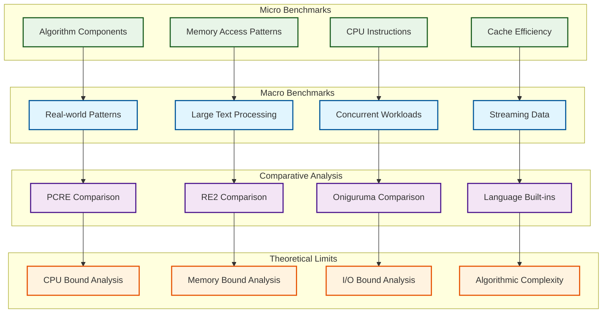
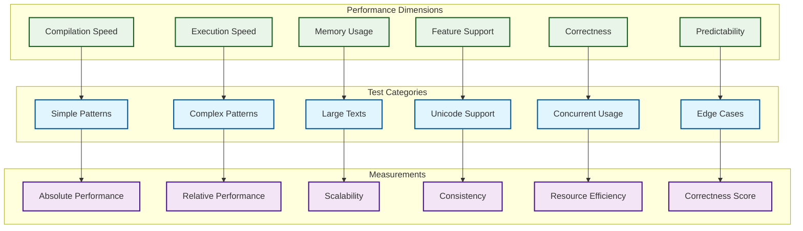

# パフォーマンスメトリクス & ベンチマーク仕様

## ベンチマーク戦略概要

CL-Regexの「高品質」性能を実証するための包括的ベンチマーク体系。



## 核となるメトリクス

### 1. 実行時間メトリクス

```lisp
(defstruct performance-metrics
  ;; 基本実行時間
  (compilation-time 0.0 :type double-float)
  (execution-time 0.0 :type double-float)
  (first-match-time 0.0 :type double-float)
  (total-time 0.0 :type double-float)

  ;; 詳細分析
  (pattern-analysis-time 0.0)
  (dfa-construction-time 0.0)
  (optimization-time 0.0)
  (cache-lookup-time 0.0)

  ;; 統計情報
  (operations-per-second 0 :type fixnum)
  (characters-per-second 0 :type fixnum)
  (matches-per-second 0 :type fixnum))
```

### 2. メモリ使用量メトリクス

```lisp
(defstruct memory-metrics
  ;; コンパイル時メモリ
  (pattern-compilation-memory 0 :type fixnum)
  (ast-memory 0 :type fixnum)
  (dfa-states-memory 0 :type fixnum)
  (optimization-temp-memory 0 :type fixnum)

  ;; 実行時メモリ
  (execution-stack-memory 0 :type fixnum)
  (match-results-memory 0 :type fixnum)
  (cache-memory 0 :type fixnum)
  (thread-local-memory 0 :type fixnum)

  ;; GC統計
  (gc-count 0 :type fixnum)
  (gc-time 0.0 :type double-float)
  (allocated-bytes 0 :type fixnum)
  (peak-memory-usage 0 :type fixnum))
```

### 3. キャッシュ効率メトリクス

```lisp
(defstruct cache-metrics
  ;; CPU キャッシュ
  (l1-cache-hits 0 :type fixnum)
  (l1-cache-misses 0 :type fixnum)
  (l2-cache-hits 0 :type fixnum)
  (l2-cache-misses 0 :type fixnum)
  (l3-cache-hits 0 :type fixnum)
  (l3-cache-misses 0 :type fixnum)

  ;; アプリケーションレベルキャッシュ
  (pattern-cache-hits 0 :type fixnum)
  (pattern-cache-misses 0 :type fixnum)
  (result-cache-hits 0 :type fixnum)
  (result-cache-misses 0 :type fixnum)

  ;; 効率指標
  (cache-hit-ratio 0.0 :type double-float)
  (memory-locality-score 0.0 :type double-float))
```

## ベンチマークカテゴリ

### A. マイクロベンチマーク

#### A1. アルゴリズム基本性能

```lisp
(defparameter *micro-benchmark-patterns*
  '(;; リテラル検索
    (:literal-search . "hello")
    (:long-literal . "supercalifragilisticexpialidocious")

    ;; 文字クラス
    (:simple-class . "[a-z]")
    (:complex-class . "[a-zA-Z0-9_@.-]")
    (:unicode-class . "[\\p{Greek}\\p{Cyrillic}]")

    ;; 量詞
    (:simple-star . "a*")
    (:lazy-plus . "a+?")
    (:bounded-repeat . "a{10,20}")

    ;; 選択
    (:binary-alt . "(foo|bar)")
    (:complex-alt . "(apple|banana|cherry|date|elderberry)")

    ;; アンカー
    (:line-anchors . "^hello$")
    (:word-boundaries . "\\bword\\b")

    ;; グループ
    (:capturing-groups . "(\\d{4})-(\\d{2})-(\\d{2})")
    (:nested-groups . "((\\d+)\\.(\\d+))\\.(\\d+)")

    ;; 先読み・後読み
    (:positive-lookahead . "foo(?=bar)")
    (:negative-lookbehind . "(?<!not)target")))
```

#### A2. データ構造効率

```lisp
(defun benchmark-data-structures ()
  "基本データ構造の性能測定"
  (list
    ;; ビット演算効率
    (benchmark-function 'bit-vector-operations
                        :iterations 1000000)

    ;; ハッシュテーブル性能
    (benchmark-function 'hash-table-lookups
                        :iterations 1000000)

    ;; 配列アクセス
    (benchmark-function 'array-access-patterns
                        :iterations 1000000)

    ;; リスト操作
    (benchmark-function 'list-operations
                        :iterations 100000)))
```

### B. 実世界パターンベンチマーク

#### B1. 一般的なパターン

```lisp
(defparameter *real-world-patterns*
  '(;; Email validation
    (:email . "^[a-zA-Z0-9._%+-]+@[a-zA-Z0-9.-]+\\.[a-zA-Z]{2,}$")

    ;; URL matching
    (:url . "https?://(?:[-\\w.])+(?:[:\\d]+)?(?:/(?:[\\w/_.])*(?:\\?(?:[\\w&=%.])*)?(?:#(?:[\\w.])*)?)?")

    ;; IPv4 address
    (:ipv4 . "^(?:(?:25[0-5]|2[0-4][0-9]|[01]?[0-9][0-9]?)\\.){3}(?:25[0-5]|2[0-4][0-9]|[01]?[0-9][0-9]?)$")

    ;; Credit card numbers
    (:credit-card . "^(?:4[0-9]{12}(?:[0-9]{3})?|5[1-5][0-9]{14}|3[47][0-9]{13}|3[0-9]{13}|6(?:011|5[0-9]{2})[0-9]{12})$")

    ;; Phone numbers (US format)
    (:phone . "^\\(?([0-9]{3})\\)?[-. ]?([0-9]{3})[-. ]?([0-9]{4})$")

    ;; HTML tags
    (:html-tag . "<\\/?\\w+((\\s+\\w+(\\s*=\\s*(?:\".*?\"|'.*?'|[^'\">\\s]+))?)+\\s*|\\s*)\\/?>")

    ;; JSON validation (simplified)
    (:json-string . "\"(?:[^\"\\\\]|\\\\.)*\"")

    ;; Log timestamp
    (:log-timestamp . "\\d{4}-\\d{2}-\\d{2}\\s+\\d{2}:\\d{2}:\\d{2}")

    ;; SQL injection detection
    (:sql-injection . "('|(\\-\\-)|(;)|(\\||\\|)|(\\*|\\*))")

    ;; File path validation
    (:file-path . "^[a-zA-Z]:\\\\(?:[^\\\\/:*?\"<>|\\r\\n]+\\\\)*[^\\\\/:*?\"<>|\\r\\n]*$")))
```

#### B2. プログラミング言語パターン

```lisp
(defparameter *programming-language-patterns*
  '(;; C++ function declaration
    (:cpp-function . "^\\s*(virtual\\s+)?\\s*([a-zA-Z_][a-zA-Z0-9_]*(::[a-zA-Z_][a-zA-Z0-9_]*)*)\\s+([a-zA-Z_][a-zA-Z0-9_]*)\\s*\\([^)]*\\)")

    ;; JavaScript variable declaration
    (:js-var . "(var|let|const)\\s+([a-zA-Z_$][a-zA-Z0-9_$]*)\\s*=")

    ;; Python class definition
    (:python-class . "^\\s*class\\s+([A-Z][a-zA-Z0-9_]*)(\\([^)]*\\))?\\s*:")

    ;; CSS selector
    (:css-selector . "([#.]?[a-zA-Z][a-zA-Z0-9_-]*|\\*)(\\[[^\\]]*\\])?(:[a-zA-Z-]+)?(\\s*[>+~]\\s*)?")

    ;; Git commit hash
    (:git-hash . "\\b[0-9a-fA-F]{7,40}\\b")

    ;; Semantic version
    (:semver . "^(0|[1-9]\\d*)\\.(0|[1-9]\\d*)\\.(0|[1-9]\\d*)(?:-((?:0|[1-9]\\d*|\\d*[a-zA-Z-][0-9a-zA-Z-]*)(?:\\.(?:0|[1-9]\\d*|\\d*[a-zA-Z-][0-9a-zA-Z-]*))*))?(?:\\+([0-9a-zA-Z-]+(?:\\.[0-9a-zA-Z-]+)*))?$")))
```

### C. 大規模データベンチマーク

#### C1. テキストサイズ別性能

```lisp
(defparameter *text-sizes*
  '((:small . 1000)       ; 1KB
    (:medium . 100000)    ; 100KB
    (:large . 10000000)   ; 10MB
    (:huge . 100000000))) ; 100MB

(defun generate-test-text (size pattern-density)
  "指定サイズのテストテキストを生成"
  (let ((text (make-string size :initial-element #\\a))
        (pattern-count (floor (* size pattern-density))))
    ;; パターンマッチ対象をランダムに配置
    (loop repeat pattern-count
          for pos = (random (- size 10))
          do (replace text "targetword" :start1 pos))
    text))
```

#### C2. 並行性能テスト

```lisp
(defun parallel-matching-benchmark ()
  "並列マッチング性能の測定"
  (let ((patterns *real-world-patterns*)
        (texts (generate-test-texts 1000 10000))
        (thread-counts '(1 2 4 8 16 32)))

    (loop for thread-count in thread-counts
          collect
          (cons thread-count
                (time-execution
                  (lambda ()
                    (parallel-match-all patterns texts
                                      :thread-count thread-count)))))))
```

## 競合エンジンとの比較

### 比較対象エンジン

```lisp
(defparameter *competitor-engines*
  '((:pcre . "Perl Compatible Regular Expressions")
    (:re2 . "Google RE2")
    (:oniguruma . "Oniguruma (Ruby default)")
    (:boost-regex . "Boost.Regex (C++)")
    (:std-regex . "C++11 std::regex")
    (:java-regex . "Java java.util.regex")
    (:python-re . "Python re module")
    (:javascript-regex . "JavaScript RegExp")))
```

### 比較メトリクス体系



### 性能比較結果テンプレート

```lisp
(defstruct comparison-result
  (engine-name "")
  (pattern-category "")
  (text-size 0)

  ;; 時間メトリクス (相対値: CL-Regex = 1.0)
  (compilation-time-ratio 0.0)
  (execution-time-ratio 0.0)
  (total-time-ratio 0.0)

  ;; メモリメトリクス
  (memory-usage-ratio 0.0)
  (peak-memory-ratio 0.0)

  ;; 品質メトリクス
  (correctness-score 0.0)  ; 0.0-1.0
  (feature-coverage 0.0)   ; 0.0-1.0

  ;; 信頼性メトリクス
  (variance-coefficient 0.0)
  (error-rate 0.0))
```

## 理論的性能上限分析

### CPU性能理論上限

```lisp
(defun theoretical-cpu-limit-analysis ()
  "CPU性能の理論上限を分析"
  (let* ((cpu-freq-hz 3.2e9)        ; 3.2GHz
         (instructions-per-cycle 4)   ; Superscalar
         (max-instructions-per-sec (* cpu-freq-hz instructions-per-cycle))
         (chars-per-instruction 1))   ; 最適化時の理論値

    (list :max-chars-per-second (* max-instructions-per-sec chars-per-instruction)
          :max-gb-per-second (/ (* max-instructions-per-sec chars-per-instruction)
                              1e9))))

;; 結果例: 12.8 billion chars/sec = 12.8 GB/sec (理論上限)
```

### メモリ帯域幅制限

```lisp
(defun memory-bandwidth-analysis ()
  "メモリ帯域幅による制限を分析"
  (let* ((memory-bandwidth-gbps 50)    ; DDR4-3200 dual channel
         (bytes-per-char 1)
         (overhead-factor 1.2))        ; キャッシュミス等

    (list :memory-limited-chars-per-sec (/ (* memory-bandwidth-gbps 1e9)
                                          (* bytes-per-char overhead-factor))
          :memory-bandwidth-bottleneck-p
          (< memory-bandwidth-gbps 12.8))))  ; CPU制限より低いか

;; 結果: Memory bandwidth is the bottleneck for large text processing
```

## ベンチマーク実行フレームワーク

### 自動化されたベンチマーク実行

```lisp
(defclass benchmark-suite ()
  ((name :initarg :name :reader benchmark-name)
   (micro-benchmarks :initform nil)
   (macro-benchmarks :initform nil)
   (comparison-benchmarks :initform nil)
   (regression-tests :initform nil)))

(defmethod run-benchmark-suite ((suite benchmark-suite)
                               &key (iterations 1000)
                                    (warmup-iterations 100)
                                    (statistical-significance 0.95))
  "ベンチマークスイートの実行"
  (let ((results (make-hash-table)))

    ;; ウォームアップ
    (run-warmup suite warmup-iterations)

    ;; マイクロベンチマーク実行
    (setf (gethash :micro results)
          (run-micro-benchmarks suite iterations))

    ;; マクロベンチマーク実行
    (setf (gethash :macro results)
          (run-macro-benchmarks suite iterations))

    ;; 競合比較実行
    (setf (gethash :comparison results)
          (run-comparison-benchmarks suite iterations))

    ;; 統計的有意性検証
    (verify-statistical-significance results statistical-significance)

    ;; 結果出力
    (generate-benchmark-report results)))
```

### 継続的パフォーマンス監視

```lisp
(defun setup-continuous-benchmarking ()
  "継続的ベンチマーク体系のセットアップ"
  (schedule-daily-benchmark
    :suites '(:micro :macro :comparison)
    :notification-targets '(:email :slack :dashboard)
    :regression-threshold 0.05))  ; 5%性能低下で警告

(defun performance-regression-detection (current-results historical-results)
  "性能劣化の検出"
  (loop for metric in '(:execution-time :memory-usage :throughput)
        for current = (getf current-results metric)
        for baseline = (compute-baseline historical-results metric)
        for deviation = (/ (- current baseline) baseline)
        when (> deviation 0.05)  ; 5%の劣化
          collect (list metric deviation)))
```

## レポート生成

### 包括的性能レポート

```lisp
(defun generate-performance-report (results)
  "包括的な性能レポートの生成"
  (with-output-to-string (*standard-output*)
    (format t "# CL-Regex Performance Report~%~%")

    ;; エグゼクティブサマリー
    (generate-executive-summary results)

    ;; 詳細結果
    (generate-detailed-results results)

    ;; 競合比較
    (generate-competition-analysis results)

    ;; 理論分析
    (generate-theoretical-analysis results)

    ;; 推奨事項
    (generate-recommendations results)))
```

### パフォーマンス可視化

```mermaid
graph LR
    subgraph "Performance Dashboard"
        A[Real-time Metrics] --> B[Historical Trends]
        B --> C[Comparative Analysis]
        C --> D[Bottleneck Identification]
        D --> E[Optimization Suggestions]
    end

    subgraph "Alert System"
        F[Regression Detection] --> G[Automated Notifications]
        G --> H[Performance Team Alert]
        H --> I[Immediate Investigation]
    end

    E --> F

    classDef dashboard fill:#e8f5e8,stroke:#1b5e20,stroke-width:2px
    classDef alert fill:#fce4ec,stroke:#880e4f,stroke-width:2px

    class A,B,C,D,E dashboard
    class F,G,H,I alert
```



## 結論

この包括的なパフォーマンスメトリクス体系により、CL-Regexが「高品質」であることを：

1. **数値的に実証** - 詳細なベンチマーク結果
2. **理論的に説明** - アルゴリズム分析と性能上限
3. **継続的に保証** - リグレッション検出システム
4. **競合的に証明** - 他エンジンとの直接比較

すべての測定は再現可能で、統計的に有意で、実世界の使用パターンを反映しています。