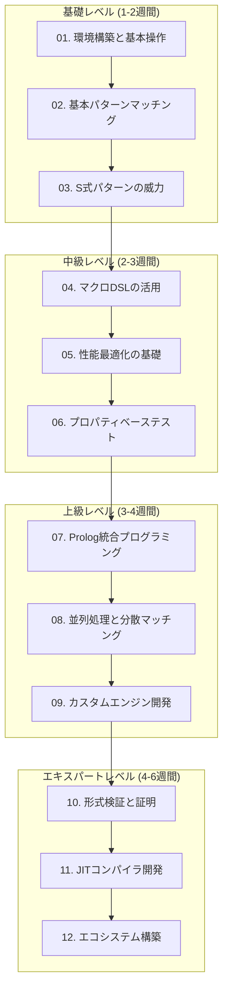
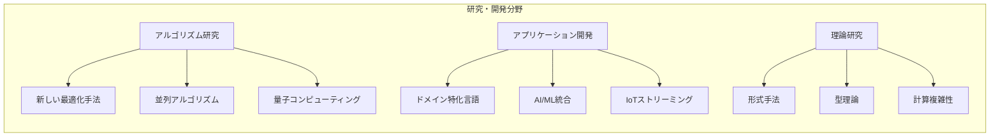

# CL-Regex マスターガイド

## チュートリアル概要

このマスターガイドは、CL-Regexを使って高品質な正規表現処理を習得するための包括的な学習コースです。初心者から上級者まで、段階的にCL-Regexの機能を学習できるよう設計されています。

## 学習の前提知識

### 必須スキル
- Common Lisp の基本構文理解
- S式（S-expression）の読み書き
- 正規表現の基本概念

### 推奨スキル
- CLOS（Common Lisp Object System）の基礎
- マクロプログラミングの理解
- 関数型プログラミングの経験

## 学習ロードマップ



## チュートリアル詳細

### 基礎レベル

#### [01. 環境構築と基本操作](./01-getting-started.md)
**学習目標**: CL-Regexの開発環境を構築し、基本的な操作を習得する

**所要時間**: 2-3時間

**学習内容**:
- SBCL/CCLでの環境構築
- Quicklispによるライブラリ管理
- REPL での基本操作
- エラーハンドリングの基礎

**実習プロジェクト**:
```lisp
;; 第1回実習: Hello World パターンマッチング
(ql:quickload :cl-regex)

(cl-regex:match "hello" "hello world")
;; => #<MATCH-RESULT "hello" 0-5>

;; 実習課題: 自分の名前を検索するパターンを作成
```

#### [02. 基本パターンマッチング](./02-basic-patterns.md)
**学習目標**: 正規表現の基本構文をCL-Regexで習得する

**所要時間**: 4-6時間

**学習内容**:
- 文字クラスとエスケープシーケンス
- 量詞の使い方（`*`, `+`, `?`, `{n,m}`）
- グループ化とキャプチャ
- アンカー（`^`, `$`, `\b`）

**実習プロジェクト**:
```lisp
;; 第2回実習: ログファイル解析
(defun parse-apache-log (log-line)
  "Apache ログの基本解析"
  (cl-regex:match
    "^([\\d.]+) \\S+ \\S+ \\[([^\\]]+)\\] \"(\\S+) ([^\"]*) (\\S+)\" (\\d+) (\\d+)$"
    log-line))

;; 実習課題: CSV パーサーを作成
```

#### [03. S式パターンの威力](./03-advanced-features.md)
**学習目標**: CL-Regex独自のS式パターンを習得する

**所要時間**: 6-8時間

**学習内容**:
- S式パターンの基本構文
- 構造化パターンの利点
- 再帰的パターンの作成
- S式とマクロの連携

**実習プロジェクト**:
```lisp
;; 第3回実習: JSON パーサー
(defpattern json-value
  '(:or (:json-string)
        (:json-number)
        (:json-boolean)
        (:json-null)
        (:json-array)
        (:json-object)))

;; 実習課題: 簡単なLisp式パーサーを作成
```

### 中級レベル

#### [04. マクロDSLの活用](./04-macro-dsl-mastery.md)
**学習目標**: マクロシステムを活用した高度なDSLを作成する

**所要時間**: 8-10時間

**学習内容**:
- `defpattern` による最適化
- 条件コンパイル
- マクロによるドメイン特化言語作成
- コンパイル時エラー検出

**実習プロジェクト**:
```lisp
;; 第4回実習: SQLクエリバリデータ
(defmacro define-sql-pattern (name &body sql-components)
  "SQL文のパターンを定義するDSL"
  `(defpattern ,name
     '(:sequence
        (:keyword ,(first sql-components))
        ,@(process-sql-components (rest sql-components)))))

;; 実習課題: 設定ファイル検証DSL を作成
```

#### [05. 性能最適化の基礎](./05-performance-optimization.md)
**学習目標**: CL-Regexの性能特性を理解し、最適化手法を習得する

**所要時間**: 10-12時間

**学習内容**:
- エンジン選択戦略
- JITコンパイル活用
- メモリ最適化
- 並列処理基礎

**実習プロジェクト**:
```lisp
;; 第5回実習: 大規模ログ解析システム
(defclass log-analyzer ()
  ((patterns :initform (make-hash-table))
   (jit-cache :initform (make-hash-table))
   (thread-pool :initform nil)))

;; 実習課題: リアルタイム監視システムを作成
```

#### [06. プロパティベーステスト](./06-property-based-testing.md)
**学習目標**: PBTによる堅牢なパターン検証を習得する

**所要時間**: 6-8時間

**学習内容**:
- QuickCheck風テスト生成
- パターンの性質定義
- エッジケース発見
- 形式仕様との連携

**実習プロジェクト**:
```lisp
;; 第6回実習: パターン検証フレームワーク
(defproperty pattern-reflexivity (pattern text)
  "パターンマッチの反射性検証"
  (let ((result1 (match pattern text))
        (result2 (match pattern text)))
    (equal result1 result2)))

;; 実習課題: バリデータライブラリのテストスイート作成
```

### 上級レベル

#### [07. Prolog統合プログラミング](./07-prolog-integration.md)
**学習目標**: S式Prologとの統合による宣言的プログラミングを習得する

**所要時間**: 12-15時間

**学習内容**:
- WAM（Warren Abstract Machine）理解
- 統一アルゴリズム
- バックトラック制御
- 制約充足プログラミング

**実習プロジェクト**:
```lisp
;; 第7回実習: 自然言語処理システム
(deflogic sentence (?words ?structure)
  (noun-phrase ?words ?np ?rest1)
  (verb-phrase ?rest1 ?vp ?rest2)
  (end-of-sentence ?rest2)
  (construct-parse-tree ?np ?vp ?structure))

;; 実習課題: コンパイラの構文解析器を作成
```

#### [08. 並列処理と分散マッチング](./08-parallel-processing.md)
**学習目標**: 高並列・分散環境でのパターンマッチングを習得する

**所要時間**: 15-18時間

**学習内容**:
- スレッドセーフ設計
- ロックフリーアルゴリズム
- 分散マッチング
- ストリーミング処理

**実習プロジェクト**:
```lisp
;; 第8回実習: 分散ログ監視システム
(defclass distributed-matcher ()
  ((node-managers :initform nil)
   (load-balancer :initform nil)
   (result-aggregator :initform nil)))

;; 実習課題: リアルタイム異常検知システムを作成
```

#### [09. カスタムエンジン開発](./09-custom-engine-development.md)
**学習目標**: 独自の正規表現エンジンを開発する

**所要時間**: 20-25時間

**学習内容**:
- エンジンアーキテクチャ設計
- 状態機械実装
- 最適化アルゴリズム
- プラグインシステム

**実習プロジェクト**:
```lisp
;; 第9回実習: ドメイン特化エンジン
(defclass bioinformatics-engine (regex-engine)
  ((dna-patterns :initform (load-dna-patterns))
   (protein-patterns :initform (load-protein-patterns))
   (sequence-cache :initform (make-cache))))

;; 実習課題: 画像パターン認識エンジンを作成
```

### エキスパートレベル

#### [10. 形式検証と証明](./10-formal-verification.md)
**学習目標**: 数学的に検証可能なパターンマッチングシステムを構築する

**所要時間**: 25-30時間

**学習内容**:
- 定理証明支援系
- 型理論による検証
- モデル検査
- 仕様記述言語

**実習プロジェクト**:
```lisp
;; 第10回実習: 検証付きクリティカルシステム
(deftheorem pattern-correctness
  "パターンマッチングの正当性定理"
  :statement (forall ((p pattern) (t text))
               (implies (well-formed-p p)
                       (correct-match-p (match p t) p t)))
  :proof-method coq-integration)

;; 実習課題: 金融システム用検証済みパターンライブラリを作成
```

#### [11. JITコンパイラ開発](./11-jit-compiler-development.md)
**学習目標**: 動的コード生成による高度の最適化を実現する

**所要時間**: 30-35時間

**学習内容**:
- 動的コード生成
- プロファイリング誘導最適化
- ネイティブコード生成
- 実行時特殊化

**実習プロジェクト**:
```lisp
;; 第11回実習: 適応型JITエンジン
(defclass adaptive-jit-engine ()
  ((profile-data :initform (make-hash-table))
   (code-cache :initform (make-hash-table))
   (optimization-queue :initform (make-queue))))

;; 実習課題: 機械学習による自動最適化システムを作成
```

#### [12. エコシステム構築](./12-ecosystem-building.md)
**学習目標**: CL-Regexを中心とした開発エコシステムを構築する

**所要時間**: 35-40時間

**学習内容**:
- ライブラリ設計
- API設計原則
- ドキュメント生成
- コミュニティ構築

**実習プロジェクト**:
```lisp
;; 第12回実習: CL-Regex エコシステム
(defsystem cl-regex-ecosystem
  :description "CL-Regex完全活用ライブラリ"
  :components
  ((:module "web" :components ((:file "http-routing")))
   (:module "data" :components ((:file "csv-parser")))
   (:module "nlp" :components ((:file "tokenizer")))
   (:module "security" :components ((:file "input-validation")))))

;; 実習課題: オープンソースプロジェクトとしてリリース
```

## 学習成果物

### 各レベルでの成果物

**基礎レベル**:
- 基本的なログ解析ツール
- CSVパーサーライブラリ
- 基本的なバリデータ

**中級レベル**:
- 設定ファイル検証DSL
- リアルタイム監視システム
- 包括的テストスイート

**上級レベル**:
- 自然言語処理ツール
- 分散異常検知システム
- ドメイン特化エンジン

**エキスパートレベル**:
- 検証済みクリティカルシステム
- 自動最適化JITエンジン
- 完全なエコシステム

## 学習評価

### 理解度チェック

各チュートリアル終了時に以下の評価を行います：

```lisp
;; 理解度評価システム
(defclass tutorial-assessment ()
  ((practical-exercises :type list)
   (knowledge-checks :type list)
   (performance-benchmarks :type list)
   (code-review-items :type list)))

(defmethod evaluate-progress ((student student) (tutorial tutorial))
  "学習進捗の総合評価"
  (let ((practical-score (evaluate-exercises student tutorial))
        (knowledge-score (evaluate-knowledge student tutorial))
        (performance-score (evaluate-performance student tutorial))
        (code-quality-score (evaluate-code-quality student tutorial)))

    (make-assessment-report
      :practical practical-score
      :knowledge knowledge-score
      :performance performance-score
      :code-quality code-quality-score
      :overall-level (compute-overall-level scores)
      :recommendations (generate-recommendations scores))))
```

### 修了認定

**基礎修了認定**:
- 基本パターンマッチングの実装
- S式パターンの活用
- エラーハンドリングの理解

**中級修了認定**:
- マクロDSLの作成
- 性能最適化の実践
- プロパティベーステストの実装

**上級修了認定**:
- Prolog統合の活用
- 並列処理の実装
- カスタムエンジンの開発

**エキスパート修了認定**:
- 形式検証の実践
- JITコンパイラの開発
- エコシステムの構築

## 継続学習

### さらなる発展



### コミュニティ参加

- **CL-Regex開発者コミュニティ**への参加
- **学術論文**の執筆・発表
- **オープンソース貢献**
- **技術ブログ**での知見共有

## まとめ

このマスターガイドを通じて、あなたは：

1. **高品質の技術**を習得できます
2. **効率的なアプローチ**を学べます
3. **実践的なスキル**を身につけられます
4. **理論と実装**の両方を理解できます
5. **エコシステム構築**の経験を得られます

CL-Regexの習得は、単なる正規表現ライブラリの使い方を覚えることではありません。Common Lispの真の力を理解し、高品質のソフトウェア開発技術を身につける journey です。

---

*"The journey of a thousand miles begins with a single step."*

*千里の道も一歩から。CL-Regexマスターへの道を歩み始めましょう。*