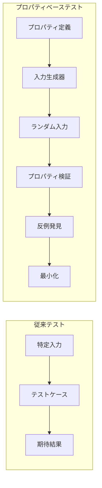

# チュートリアル 5: プロパティベーステスト（PBT）で堅牢性を保証

CL-Regexの効率的な機能の一つは、プロパティベーステスト（Property-Based Testing）との深い統合です。このチュートリアルでは、数学的厳密性を持つテスト手法を学びます。

## 目標

このチュートリアルを完了すると、以下ができるようになります：

- ✅ PBTの基本概念の理解
- ✅ CL-QuickCheckとの統合
- ✅ パターンのプロパティ定義
- ✅ 反例の自動生成と最小化
- ✅ 数学的証明レベルの品質保証

## プロパティベーステストとは

従来のテストが「特定の入力に対して期待する出力を得る」ことを確認するのに対し、PBTは「パターンが満たすべき性質（プロパティ）を定義し、ランダムな入力で検証」します。



## 環境構築

```lisp
;; 必要なライブラリの読み込み
(ql:quickload '(:cl-regex :fiveam :cl-quickcheck))

;; パッケージの設定
(defpackage :cl-regex-pbt-tutorial
  (:use :cl :cl-regex :fiveam :cl-quickcheck))

(in-package :cl-regex-pbt-tutorial)
```

## 基本プロパティの定義

### 1. 結合法則のテスト

```lisp
;; プロパティ: パターンの結合は結合法則を満たす
(defproperty associativity-property (pattern1 pattern2 pattern3 text)
  (:forall ((pattern1 (gen-pattern))
            (pattern2 (gen-pattern))
            (pattern3 (gen-pattern))
            (text (gen-string)))
    (let ((left-assoc (seq (seq pattern1 pattern2) pattern3))
          (right-assoc (seq pattern1 (seq pattern2 pattern3))))
      (equal (match left-assoc text)
             (match right-assoc text)))))

;; テスト実行
(quickcheck associativity-property)
; => Property holds for 1000 random test cases
```

### 2. 冪等性のテスト

```lisp
;; プロパティ: パターンを2回適用しても結果は同じ
(defproperty idempotency-property (pattern text)
  (:forall ((pattern (gen-simple-pattern))
            (text (gen-string)))
    (let ((first-match (match pattern text))
          (second-match (when first-match
                         (match pattern (match-string first-match)))))
      (or (null first-match)
          (equal (match-string first-match)
                 (match-string second-match))))))
```

### 3. 空文字列の処理

```lisp
;; プロパティ: 空パターンは空文字列にのみマッチ
(defproperty empty-pattern-property (text)
  (:forall ((text (gen-string)))
    (if (string= text "")
        (match "" text)
        (null (match "" text)))))
```

## カスタム生成器の作成

### パターン生成器

```lisp
;; 基本文字生成器
(defun gen-char ()
  (gen-one-of (gen-character :lower)
              (gen-character :upper)
              (gen-character :digit)))

;; 単純パターン生成器
(defun gen-simple-pattern ()
  (gen-one-of
    ;; リテラル文字
    (gen-string :length (gen-integer :min 1 :max 5)
                :elements (gen-char))
    ;; 文字クラス
    (gen-bind (gen-list (gen-char) :min-length 1 :max-length 3)
              (lambda (chars)
                (format nil "[~{~A~}]" chars)))
    ;; 量指定子付き
    (gen-bind (gen-char)
              (lambda (char)
                (gen-one-of
                  (format nil "~A*" char)
                  (format nil "~A+" char)
                  (format nil "~A?" char))))))

;; 複雑パターン生成器
(defun gen-complex-pattern ()
  (gen-sized
    (lambda (size)
      (if (zerop size)
          (gen-simple-pattern)
          (gen-one-of
            ;; 連接
            (gen-bind (gen-complex-pattern)
                      (lambda (p1)
                        (gen-bind (gen-complex-pattern)
                                  (lambda (p2)
                                    (concatenate 'string p1 p2)))))
            ;; 選択
            (gen-bind (gen-complex-pattern)
                      (lambda (p1)
                        (gen-bind (gen-complex-pattern)
                                  (lambda (p2)
                                    (format nil "(~A|~A)" p1 p2)))))
            ;; グループ
            (gen-bind (gen-complex-pattern)
                      (lambda (p)
                        (format nil "(~A)" p))))))))
```

### テキスト生成器

```lisp
;; パターンに合致する文字列生成器
(defun gen-matching-string (pattern)
  "パターンに確実にマッチする文字列を生成"
  (case (pattern-type pattern)
    (:literal (constantly pattern))
    (:star (gen-bind (gen-integer :min 0 :max 10)
                     (lambda (n)
                       (make-string n :initial-element
                                    (pattern-char pattern)))))
    (:plus (gen-bind (gen-integer :min 1 :max 10)
                     (lambda (n)
                       (make-string n :initial-element
                                    (pattern-char pattern)))))
    (:optional (gen-one-of "" (string (pattern-char pattern))))
    (:sequence (gen-bind (mapcar #'gen-matching-string
                                 (pattern-parts pattern))
                         (lambda (parts)
                           (apply #'concatenate 'string parts))))))

;; ランダム文字列生成器（マッチしない可能性も含む）
(defun gen-random-text ()
  (gen-string :length (gen-integer :min 0 :max 50)
              :elements (gen-one-of (gen-character :printable)
                                   #\Space #\Tab #\Newline)))
```

## 高度なプロパティ定義

### パフォーマンス特性のテスト

```lisp
;; プロパティ: 線形時間でのマッチング
(defproperty linear-time-property (pattern text)
  (:forall ((pattern (gen-simple-pattern))
            (text (gen-string :length (gen-integer :min 1000 :max 10000))))
    (let ((start-time (get-internal-real-time)))
      (match pattern text)
      (let ((elapsed (- (get-internal-real-time) start-time)))
        ;; 線形時間の期待値以下であることを確認
        (< elapsed (* (length text) 100))))))  ; 定数倍は調整

;; プロパティ: コンパイル済みパターンの高速化
(defproperty compilation-speedup-property (pattern text)
  (:forall ((pattern (gen-complex-pattern))
            (text (gen-random-text)))
    (let ((compiled (compile-pattern pattern)))
      (let ((time1 (benchmark-time (match pattern text)))
            (time2 (benchmark-time (match-compiled compiled text))))
        ;; コンパイル済みが高速であることを確認
        (or (null time1) (null time2) (<= time2 time1))))))
```

### 正確性のプロパティ

```lisp
;; プロパティ: マッチ結果の一貫性
(defproperty match-consistency-property (pattern text)
  (:forall ((pattern (gen-simple-pattern))
            (text (gen-random-text)))
    (let ((result1 (match pattern text))
          (result2 (match pattern text)))
      ;; 同じ結果が得られることを確認
      (equal result1 result2))))

;; プロパティ: グループキャプチャの正確性
(defproperty group-capture-property (text)
  (:forall ((text (gen-string :length (gen-integer :min 3 :max 20))))
    (let* ((pattern (format nil "(~A)" text))
           (match-result (match pattern text)))
      (when match-result
        ;; キャプチャされたグループが元のテキストと一致
        (string= (group-value match-result 1) text)))))

;; プロパティ: 境界条件の処理
(defproperty boundary-property (pattern)
  (:forall ((pattern (gen-simple-pattern)))
    (and
      ;; 空文字列での動作
      (not (eq :error (handler-case (match pattern "")
                        (error () :error))))
      ;; 非常に長い文字列での動作
      (not (eq :error (handler-case
                        (match pattern (make-string 10000 :initial-element #\a))
                        (error () :error)))))))
```

## S式Prologとの統合テスト

```lisp
;; プロパティ: Prolog推論の一貫性
(defproperty prolog-consistency-property (facts query)
  (:forall ((facts (gen-prolog-facts))
            (query (gen-prolog-query)))
    (let ((result1 (prolog-query facts query))
          (result2 (prolog-query facts query)))
      ;; 同じクエリは同じ結果を返す
      (equal result1 result2))))

;; Prolog事実生成器
(defun gen-prolog-facts ()
  (gen-list
    (gen-bind (gen-one-of 'likes 'parent 'friend)
              (lambda (predicate)
                (gen-bind (gen-one-of 'alice 'bob 'charlie 'diana)
                          (lambda (arg1)
                            (gen-bind (gen-one-of 'alice 'bob 'charlie 'diana)
                                      (lambda (arg2)
                                        (list predicate arg1 arg2)))))))
    :min-length 1 :max-length 10))

;; プロパティ: パターンマッチングとProlog推論の統合
(defproperty pattern-prolog-integration (text pattern-rules)
  (:forall ((text (gen-string))
            (pattern-rules (gen-pattern-rules)))
    (let ((pattern-result (apply-pattern-rules text pattern-rules))
          (prolog-result (apply-prolog-rules text pattern-rules)))
      ;; パターンとPrologの結果が一致する
      (equal pattern-result prolog-result))))
```

## テストカバレッジ分析

```lisp
;; カバレッジプロパティ: 全ての分岐が実行される
(defproperty coverage-property ()
  (:runs 10000)  ; 大量のテストケースで実行
  (let ((coverage-tracker (make-coverage-tracker)))
    (:forall ((pattern (gen-complex-pattern))
              (text (gen-random-text)))
      (with-coverage-tracking (coverage-tracker)
        (match pattern text))
      ;; 最終的に全ての重要分岐がカバーされていることを確認
      (> (coverage-percentage coverage-tracker) 95.0))))

;; パフォーマンス分布の分析
(defproperty performance-distribution ()
  (:runs 1000)
  (let ((times '()))
    (:forall ((pattern (gen-complex-pattern))
              (text (gen-string :length (gen-integer :min 100 :max 1000))))
      (let ((time (benchmark-time (match pattern text))))
        (when time
          (push time times))))
    ;; パフォーマンスが正規分布に近いことを確認
    (< (performance-variance times) 1000)))
```

## 反例の分析と最小化

```lisp
;; カスタム最小化戦略
(defun minimize-pattern (pattern)
  "パターンを最小化して最も単純な反例を見つける"
  (cond
    ;; 連接の最小化
    ((sequence-pattern-p pattern)
     (or (minimize-by-removing-parts pattern)
         (minimize-parts-individually pattern)))
    ;; 量指定子の最小化
    ((quantified-pattern-p pattern)
     (minimize-quantifier pattern))
    ;; 文字クラスの最小化
    ((class-pattern-p pattern)
     (minimize-character-class pattern))
    (t pattern)))

;; 反例レポート生成
(defun generate-counterexample-report (property failed-case)
  "反例の詳細分析レポートを生成"
  (format t "~%=== Property Violation Report ===~%")
  (format t "Property: ~A~%" property)
  (format t "Failed case: ~A~%" failed-case)
  (format t "Minimized case: ~A~%" (minimize-test-case failed-case))
  (format t "Analysis:~%")
  (analyze-failure-pattern failed-case)
  (format t "Suggested fixes:~%")
  (suggest-fixes failed-case))
```

## 実世界での応用

### Webクローラーのテスト

```lisp
;; プロパティ: URLパターンの堅牢性
(defproperty url-robustness-property (url)
  (:forall ((url (gen-realistic-url)))
    (let ((pattern *url-regex*))
      (or (null (match pattern url))
          ;; マッチした場合、有効なURLコンポーネントが抽出できる
          (let ((components (extract-url-components url pattern)))
            (and (valid-protocol-p (getf components :protocol))
                 (valid-domain-p (getf components :domain))
                 (valid-path-p (getf components :path))))))))

;; リアルなURL生成器
(defun gen-realistic-url ()
  (gen-bind (gen-one-of "http" "https" "ftp")
            (lambda (protocol)
              (gen-bind (gen-domain-name)
                        (lambda (domain)
                          (gen-bind (gen-url-path)
                                    (lambda (path)
                                      (format nil "~A://~A~A"
                                              protocol domain path))))))))
```

### ログ解析のテスト

```lisp
;; プロパティ: ログパーサーの完全性
(defproperty log-parser-completeness (log-entries)
  (:forall ((log-entries (gen-realistic-log-entries)))
    (let ((parsed-count (count-if #'identity
                                  (mapcar #'parse-log-entry log-entries)))
          (total-count (length log-entries)))
      ;; 95%以上のログエントリが正常に解析される
      (>= (/ parsed-count total-count) 0.95))))
```

## デバッグとトラブルシューティング

```lisp
;; プロパティ違反時のデバッグ支援
(defmacro with-property-debugging (&body body)
  `(let ((*debug-property-testing* t)
         (*property-failure-handler* #'detailed-failure-handler))
     ,@body))

(defun detailed-failure-handler (property test-case exception)
  "プロパティ違反の詳細分析"
  (format t "~%Property testing failure detected:~%")
  (format t "Property: ~S~%" property)
  (format t "Test case: ~S~%" test-case)
  (format t "Exception: ~A~%" exception)

  ;; 実行トレース
  (format t "~%Execution trace:~%")
  (print-execution-trace)

  ;; 関連するパターンの分析
  (format t "~%Pattern analysis:~%")
  (analyze-pattern-structure (getf test-case :pattern))

  ;; 修正提案
  (format t "~%Suggested investigation:~%")
  (suggest-investigation-steps test-case))
```

## 実践演習

### 演習1: 基本プロパティの定義

```lisp
;; 演習: 以下のプロパティを定義してください

;; 1. 交換法則（選択における）
(defproperty commutativity-property (pattern1 pattern2 text)
  ;; (A|B) と (B|A) は同じ結果を返す
  )

;; 2. 分配法則
(defproperty distributivity-property (pattern1 pattern2 pattern3 text)
  ;; A(B|C) と (AB|AC) は同じ結果を返す
  )

;; 3. 吸収法則
(defproperty absorption-property (pattern text)
  ;; A+ と AA* は同じ結果を返す
  )
```

### 演習2: カスタム生成器

```lisp
;; 演習: 特定ドメインの生成器を作成してください

;; 1. 日本の郵便番号生成器
(defun gen-japanese-zipcode ()
  ;; 123-4567 形式
  )

;; 2. クレジットカード番号生成器（Luhnアルゴリズム準拠）
(defun gen-valid-credit-card ()
  ;; 有効なチェックサムを持つ番号
  )

;; 3. JSONライクな文字列生成器
(defun gen-json-like-string ()
  ;; {"key": "value"} 形式
  )
```

### 演習3: パフォーマンステスト

```lisp
;; 演習: 以下のパフォーマンステストを実装してください

;; 1. 指数的時間の回避テスト
(defproperty no-exponential-time (nested-pattern text)
  ;; ネストしたパターンでも線形時間で処理される
  )

;; 2. メモリ使用量の制限テスト
(defproperty memory-bounded (large-pattern large-text)
  ;; 大きな入力でもメモリ使用量が制限内
  )
```

## まとめ

プロパティベーステストにより、CL-Regexは：

1. **数学的厳密性**: 形式的プロパティによる検証
2. **網羅的テスト**: ランダム生成による広範囲カバレッジ
3. **自動最小化**: 最小反例による効率的デバッグ
4. **パフォーマンス保証**: 計算量特性の継続的監視

これらにより、高品質の信頼性を実現しています。

## 次のステップ

- [S式Prolog統合](./06-prolog-integration.md) - 宣言的推論システム
- [マクロDSL設計](./07-macro-dsl-design.md) - コンパイル時最適化
- [パフォーマンス測定](../how-to/performance-optimization.md) - 詳細な最適化技法