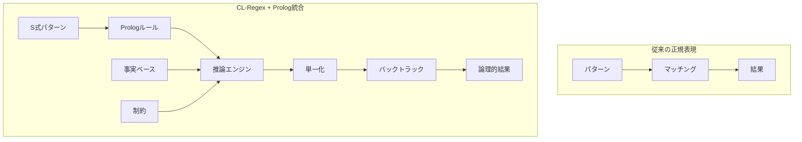

# チュートリアル 6: S式Prolog統合による宣言的推論

CL-Regexの最も効率的な機能の一つは、S式Prologとの深い統合です。これにより、パターンマッチングに論理プログラミングの威力を加え、従来不可能だった高度な推論を実現します。

## 目標

このチュートリアルを完了すると、以下ができるようになります：

- ✅ S式Prologの基本概念の理解
- ✅ パターンマッチングとの統合
- ✅ 宣言的クエリシステムの活用
- ✅ DCG（Definite Clause Grammar）による構文解析
- ✅ 高度な推論と最適化

## S式Prologとは

S式Prologは、Prologの論理プログラミングパラダイムをS式で表現したCL-Regex独自の拡張です。これにより、パターンマッチングに推論能力を追加できます。



## 環境準備

```lisp
;; 必要なライブラリの読み込み
(ql:quickload '(:cl-regex :cl-prolog-embedded))

;; パッケージの設定
(defpackage :cl-regex-prolog-tutorial
  (:use :cl :cl-regex :cl-prolog))

(in-package :cl-regex-prolog-tutorial)

;; Prolog環境の初期化
(initialize-prolog-environment)
```

## 基本的な事実とルールの定義

### シンプルな事実

```lisp
;; 基本的な事実の定義
(assert-fact '(parent john mary))
(assert-fact '(parent john tom))
(assert-fact '(parent mary alice))
(assert-fact '(parent tom bob))

;; 性別の定義
(assert-fact '(male john))
(assert-fact '(male tom))
(assert-fact '(male bob))
(assert-fact '(female mary))
(assert-fact '(female alice))

;; クエリの実行
(query '(parent john ?child))
; => ((?child . mary) (?child . tom))

(query '(male ?person))
; => ((?person . john) (?person . tom) (?person . bob))
```

### ルールの定義

```lisp
;; 祖父母の関係を定義
(assert-rule '(grandparent ?gp ?gc)
             '(and (parent ?gp ?p)
                   (parent ?p ?gc)))

;; 兄弟関係の定義
(assert-rule '(sibling ?x ?y)
             '(and (parent ?p ?x)
                   (parent ?p ?y)
                   (not (= ?x ?y))))

;; 祖父の定義
(assert-rule '(grandfather ?gf ?gc)
             '(and (grandparent ?gf ?gc)
                   (male ?gf)))

;; クエリ例
(query '(grandparent john ?grandchild))
; => ((?grandchild . alice) (?grandchild . bob))

(query '(grandfather ?gf alice))
; => ((?gf . john))
```

## パターンマッチングとの統合

### 基本統合

```lisp
;; パターンにPrologルールを組み込む
(define-prolog-pattern email-validation
  :pattern '(:sequence
             (:capture user (:+ (:class :alnum #\. #\_ #\-)))
             #\@
             (:capture domain (:+ (:class :alnum #\.)))
             #\.
             (:capture tld (:between 2 6 :alpha)))
  :rules '((valid-email ?user ?domain ?tld)
           (valid-user ?user)
           (valid-domain ?domain)
           (valid-tld ?tld)))

;; ユーザー名の妥当性ルール
(assert-rule '(valid-user ?user)
             '(and (>= (length ?user) 3)
                   (<= (length ?user) 20)
                   (not (starts-with ?user #\.))
                   (not (ends-with ?user #\.))))

;; ドメインの妥当性ルール
(assert-rule '(valid-domain ?domain)
             '(and (contains ?domain #\.)
                   (not (starts-with ?domain #\.))
                   (not (ends-with ?domain #\.))))

;; TLDの妥当性ルール
(assert-rule '(valid-tld ?tld)
             '(member ?tld (com org net edu gov mil)))

;; 統合されたバリデーション
(defun validate-email-with-logic (email)
  (let ((match-result (match email-validation email)))
    (when match-result
      (let ((user (captured-group match-result 'user))
            (domain (captured-group match-result 'domain))
            (tld (captured-group match-result 'tld)))
        (query `(valid-email ,user ,domain ,tld))))))

;; 使用例
(validate-email-with-logic "user@example.com")
; => ((?user . "user") (?domain . "example") (?tld . "com"))

(validate-email-with-logic "..invalid@bad.")
; => NIL
```

### 条件付きマッチング

```lisp
;; 数値の条件付きマッチング
(define-prolog-pattern number-range
  :pattern '(:capture number (:+ :digit))
  :constraints '((integer-value ?number ?int)
                 (in-range ?int 1 100)))

(assert-rule '(integer-value ?str ?int)
             '(= ?int (parse-integer ?str)))

(assert-rule '(in-range ?n ?min ?max)
             '(and (>= ?n ?min) (<= ?n ?max)))

;; 使用例
(match-with-constraints number-range "50")   ; => マッチ
(match-with-constraints number-range "150")  ; => NIL
```

## DCG（Definite Clause Grammar）による構文解析

### 基本DCG

```lisp
;; 文法ルールの定義
(define-dcg sentence
  (noun-phrase verb-phrase))

(define-dcg noun-phrase
  (determiner noun))

(define-dcg verb-phrase
  (verb noun-phrase))

(define-dcg determiner
  ("the"))

(define-dcg determiner
  ("a"))

(define-dcg noun
  ("cat"))

(define-dcg noun
  ("dog"))

(define-dcg verb
  ("chases"))

(define-dcg verb
  ("sees"))

;; パース例
(parse-dcg sentence "the cat chases a dog")
; => (sentence (noun-phrase (determiner "the") (noun "cat"))
;             (verb-phrase (verb "chases")
;                         (noun-phrase (determiner "a") (noun "dog"))))
```

### 高度なDCG：計算付き

```lisp
;; 算術式の文法
(define-dcg expression
  (term expression-rest))

(define-dcg expression-rest
  ("+" term expression-rest)
  :action (lambda (op term rest)
            `(+ ,term ,rest)))

(define-dcg expression-rest
  ("-" term expression-rest)
  :action (lambda (op term rest)
            `(- ,term ,rest)))

(define-dcg expression-rest
  ()
  :action (lambda () 0))

(define-dcg term
  (factor term-rest))

(define-dcg term-rest
  ("*" factor term-rest)
  :action (lambda (op factor rest)
            `(* ,factor ,rest)))

(define-dcg term-rest
  ("/" factor term-rest)
  :action (lambda (op factor rest)
            `(/ ,factor ,rest)))

(define-dcg term-rest
  ()
  :action (lambda () 1))

(define-dcg factor
  (number))

(define-dcg factor
  ("(" expression ")"))

(define-dcg number
  (:+ :digit)
  :action #'parse-integer)

;; パースと計算
(defun calculate-expression (expr-string)
  (let ((ast (parse-dcg expression expr-string)))
    (when ast
      (eval-arithmetic-ast ast))))

(calculate-expression "3 + 4 * 2")
; => 11
```

## 高度な推論パターン

### 再帰的パターン解析

```lisp
;; ネストした括弧の解析
(define-prolog-pattern balanced-parens
  :pattern '(:or (:sequence "(" (:recursive balanced-parens) ")")
                 (:epsilon))
  :rules '((balanced ?text)
           (count-depth ?text ?depth)
           (<= ?depth 10)))  ; 最大深度制限

(assert-rule '(balanced ?text)
             '(= (count-char ?text #\()
                 (count-char ?text #\))))

;; ネストレベルの計算
(assert-rule '(count-depth ?text ?depth)
             '(fold-chars ?text 0 ?depth count-paren-depth))

(defun count-paren-depth (char current-depth)
  (case char
    (#\( (1+ current-depth))
    (#\) (1- current-depth))
    (t current-depth)))
```

### パターン最適化の推論

```lisp
;; パターン最適化ルール
(assert-rule '(optimize-pattern ?input ?output)
             '(or (eliminate-redundancy ?input ?output)
                  (factor-common ?input ?output)
                  (simplify-quantifiers ?input ?output)))

;; 冗長性除去
(assert-rule '(eliminate-redundancy (:sequence ?a ?a) ?a)
             '(repeatable ?a))

(assert-rule '(eliminate-redundancy (:or ?a ?a) ?a)
             'true)

;; 共通因子の括り出し
(assert-rule '(factor-common (:or (:sequence ?prefix ?a)
                                  (:sequence ?prefix ?b))
                             (:sequence ?prefix (:or ?a ?b)))
             'true)

;; 量指定子の簡略化
(assert-rule '(simplify-quantifiers (:sequence (:* ?a) (:+ ?a))
                                   (:+ ?a))
             'true)

;; 使用例
(optimize-pattern-with-logic
  '(:or (:sequence "hello" "world")
        (:sequence "hello" "universe")))
; => (:sequence "hello" (:or "world" "universe"))
```

### セマンティック解析

```lisp
;; 意味論的制約の定義
(define-semantic-pattern url-semantic
  :syntax '(:sequence
            (:capture protocol (:or "http" "https" "ftp"))
            "://"
            (:capture domain (:+ (:not #\/)))
            (:capture path (:* :any)))
  :semantics '((valid-protocol ?protocol)
               (reachable-domain ?domain)
               (secure-path ?path ?protocol)))

;; セマンティックルール
(assert-rule '(valid-protocol ?p)
             '(member ?p (http https ftp smtp)))

(assert-rule '(reachable-domain ?domain)
             '(or (ends-with ?domain ".com")
                  (ends-with ?domain ".org")
                  (ends-with ?domain ".net")
                  (ip-address ?domain)))

(assert-rule '(secure-path ?path "https")
             'true)  ; HTTPSなら常に安全

(assert-rule '(secure-path ?path "http")
             '(not (contains-sensitive ?path)))

(assert-rule '(contains-sensitive ?path)
             '(or (contains ?path "password")
                  (contains ?path "key")
                  (contains ?path "token")))

;; セマンティック解析の実行
(defun analyze-url-semantics (url)
  (let ((syntax-match (match url-semantic url)))
    (when syntax-match
      (let ((protocol (captured-group syntax-match 'protocol))
            (domain (captured-group syntax-match 'domain))
            (path (captured-group syntax-match 'path)))
        (query `(and (valid-protocol ,protocol)
                     (reachable-domain ,domain)
                     (secure-path ,path ,protocol)))))))
```

## 制約充足問題の解決

### 数独ソルバーとの統合

```lisp
;; 数独制約をパターンマッチングで表現
(define-constraint-pattern sudoku-cell
  :pattern '(:capture digit (:class "1-9"))
  :constraints '((valid-in-row ?digit ?row ?puzzle)
                 (valid-in-col ?digit ?col ?puzzle)
                 (valid-in-box ?digit ?row ?col ?puzzle)))

;; 制約ルール
(assert-rule '(valid-in-row ?digit ?row ?puzzle)
             '(not (member ?digit (get-row ?puzzle ?row))))

(assert-rule '(valid-in-col ?digit ?col ?puzzle)
             '(not (member ?digit (get-col ?puzzle ?col))))

(assert-rule '(valid-in-box ?digit ?row ?col ?puzzle)
             '(let ((box-digits (get-box-digits ?puzzle ?row ?col)))
                (not (member ?digit box-digits))))

;; 数独の解法
(defun solve-sudoku-with-patterns (puzzle)
  (backtrack-with-constraints puzzle sudoku-cell))
```

### スケジューリング問題

```lisp
;; タイムスロットパターン
(define-scheduling-pattern time-slot
  :pattern '(:sequence
             (:capture start-hour (:repeat 2 :digit))
             ":"
             (:capture start-min (:repeat 2 :digit))
             "-"
             (:capture end-hour (:repeat 2 :digit))
             ":"
             (:capture end-min (:repeat 2 :digit)))
  :constraints '((valid-time ?start-hour ?start-min)
                 (valid-time ?end-hour ?end-min)
                 (before ?start-hour ?start-min ?end-hour ?end-min)
                 (reasonable-duration ?start-hour ?start-min ?end-hour ?end-min)))

;; スケジュール制約
(assert-rule '(valid-time ?hour ?min)
             '(and (>= ?hour 0) (< ?hour 24)
                   (>= ?min 0) (< ?min 60)))

(assert-rule '(before ?h1 ?m1 ?h2 ?m2)
             '(or (< ?h1 ?h2)
                  (and (= ?h1 ?h2) (< ?m1 ?m2))))

(assert-rule '(reasonable-duration ?h1 ?m1 ?h2 ?m2)
             '(let ((duration (time-diff ?h1 ?m1 ?h2 ?m2)))
                (and (>= duration 30)    ; 最低30分
                     (<= duration 480)))) ; 最大8時間
```

## デバッグとプロファイリング

### 推論トレース

```lisp
;; 推論過程の可視化
(defmacro with-inference-trace (&body body)
  `(let ((*trace-inference* t)
         (*inference-depth* 0))
     ,@body))

(defun trace-inference (goal bindings)
  (format t "~V@TGoal: ~S~%" (* *inference-depth* 2) goal)
  (format t "~V@TBindings: ~S~%" (* *inference-depth* 2) bindings)
  (let ((*inference-depth* (1+ *inference-depth*)))
    (call-next-method)))

;; 使用例
(with-inference-trace
  (query '(grandparent john ?gc)))
; => Goal: (grandparent john ?gc)
;    Bindings: NIL
;      Goal: (parent john ?p)
;      Bindings: ((?p . mary))
;        Goal: (parent mary ?gc)
;        Bindings: ((?p . mary) (?gc . alice))
;      Goal: (parent john ?p)
;      Bindings: ((?p . tom))
;        Goal: (parent tom ?gc)
;        Bindings: ((?p . tom) (?gc . bob))
```

### パフォーマンス最適化

```lisp
;; インデックス化による高速化
(defun index-facts (facts)
  "事実をインデックス化して高速検索を可能にする"
  (let ((index (make-hash-table :test 'equal)))
    (dolist (fact facts)
      (let ((predicate (first fact)))
        (push fact (gethash predicate index))))
    index))

;; メモ化による最適化
(defmacro memoized-rule (name params &body body)
  `(let ((memo-table (make-hash-table :test 'equal)))
     (defun ,name ,params
       (let ((key (list ,@params)))
         (or (gethash key memo-table)
             (setf (gethash key memo-table)
                   (progn ,@body)))))))

;; 使用例
(memoized-rule expensive-inference (goal bindings)
  (complex-unification goal bindings))
```

## 実践演習

### 演習1: 基本的な論理プログラム

```lisp
;; 演習: 以下の関係を定義してください

;; 1. 先祖関係
(assert-rule '(ancestor ?a ?d)
             ;; あなたのコードをここに
             )

;; 2. いとこ関係
(assert-rule '(cousin ?x ?y)
             ;; あなたのコードをここに
             )

;; 3. 世代差の計算
(assert-rule '(generation-gap ?a ?d ?gap)
             ;; あなたのコードをここに
             )
```

### 演習2: パターンマッチング統合

```lisp
;; 演習: 電話番号の地域判定システム

(define-prolog-pattern phone-number
  :pattern ;; あなたのパターンをここに
  :rules   ;; あなたのルールをここに
  )

;; 地域コードの定義
(assert-fact '(area-code "03" "東京"))
(assert-fact '(area-code "06" "大阪"))
;; 他の地域コードを追加

;; 使用例の実装
(defun identify-phone-region (phone)
  ;; あなたのコードをここに
  )
```

### 演習3: DCGによる構文解析

```lisp
;; 演習: JSONライクな構造の解析

(define-dcg json-value
  ;; あなたの文法ルールをここに
  )

;; テストケース
(parse-dcg json-value "{\"name\": \"John\", \"age\": 30}")
```

## 高度なトピック

### 制約論理プログラミング（CLP）

```lisp
;; 数値制約の処理
(define-constraint-domain number-domain
  :variables (?x ?y ?z)
  :constraints ((>= ?x 0)
                (<= ?x 100)
                (= ?y (* ?x 2))
                (> ?z ?y)))

;; 制約充足
(solve-constraints number-domain
  '((?x . ?X) (?y . ?Y) (?z . ?Z)))
; => 有効な値の組み合わせ
```

### 並行推論

```lisp
;; 並列クエリ処理
(defun parallel-query (queries)
  "複数のクエリを並列実行"
  (lparallel:pmap 'list
    (lambda (query)
      (with-timeout (1.0)  ; 1秒でタイムアウト
        (query query)))
    queries))

;; 使用例
(parallel-query '((parent ?p mary)
                  (parent ?p tom)
                  (grandparent ?gp ?gc)))
```

## まとめ

S式Prolog統合により、CL-Regexは：

1. **宣言的パターン記述**: 論理ルールによる柔軟な表現
2. **高度な推論能力**: バックトラックと単一化
3. **制約充足**: 複雑な条件の自動解決
4. **構文解析**: DCGによる文法記述
5. **最適化**: 論理的等価性による変換

これらにより、従来の正規表現では不可能だった高度な文字列処理を実現します。

## 次のステップ

- [マクロDSL設計](./07-macro-dsl-design.md) - コンパイル時最適化の極意
- [パフォーマンス最適化](../how-to/performance-optimization.md) - 推論エンジンの高速化
- [実装パターン](../explanation/prolog-integration.md) - 内部アーキテクチャの詳細